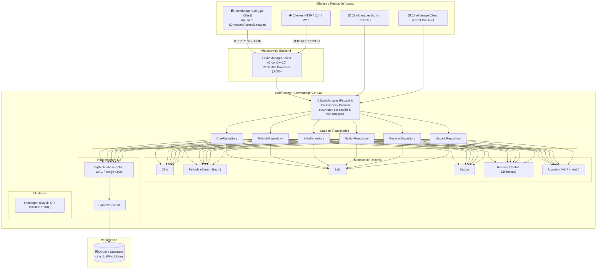

# 🎬 CineManager v2.0


-003B57?style=flat&logo=sqlite)


-brightgreen.svg?style=flat)


> 🚀 **Estado del proyecto:** **Versión 2.0 de Producción** — Arquitectura desacoplada en C++20 con backend REST API multihilo, cliente gráfico nativo Qt6 asíncrono, persistencia transaccional SQLite con WAL/FK, suite de pruebas automatizadas GoogleTest y despliegue orquestado en Docker & CI/CD.

---

## 📌 Descripción General

**CineManager** es un sistema transaccional integral de gestión, visualización de cartelera y venta de entradas de cine. Diseñado bajo los más estrictos estándares de ingeniería de software comercial, el proyecto aplica los patrones de **Arquitectura Hexagonal (Ports & Adapters)** y **Repository Pattern**.

El núcleo del dominio y la persistencia reside en una librería estática compilada de forma independiente (`CineManagerCore.a`), la cual alimenta tanto a un **microservicio web REST API asíncrono** (`CineManagerServer`) como a una **aplicación de escritorio nativa Qt6** (`CineManagerGUI`), interfaces de consola y suites de pruebas automatizadas.

---

## 🏗️ Arquitectura del Sistema



---

## 🗺️ Roadmap de Características Implementadas

- [x] **Fase 1: Motor Básico (POO)**: Dominio de entidades en memoria y validaciones de negocio.
- [x] **Fase 2: Persistencia I/O**: Lectura y serialización de estado en formato plano CSV.
- [x] **Fase 3: Base de Datos Relacional**: Integración de SQLite3 bajo el patrón Repository con soporte transaccional.
- [x] **Fase 4: Concurrencia y Multihilo**: Exclusión mutua *fine-grained* (`std::mutex` por sesión) y *thread* demonio para expiración de reservas pendientes.
- [x] **Fase 5: Core Library (Arquitectura Hexagonal)**: Desacoplamiento total del dominio en `libCineManagerCore.a`.
- [x] **Fase 6: Interfaz Gráfica Nativa (Qt6)**:
  - [x] Front-end moderno en tema oscuro con tarjetas interactivas (`CineCardWidget`, `MovieCardWidget`).
  - [x] Buscador y filtrado dinámico de películas por texto y género en tiempo real.
  - [x] Mapa de butacas interactivo con selección múltiple mediante `std::set`.
  - [x] **Tarifas Dinámicas (`TarifasDialog`)**: Adulto, Niño, Jubilado, Estudiante.
  - [x] **Generador de QR Real (`qrcodegen` / `QrHelper`)**: Firma digital de la entrada en estándar ISO/IEC 18004.
  - [x] **Gestión de Aforos**: Detección de salas llenas `(LLENA)` y bloqueo preventivo de reservas.
  - [x] **Autenticación (`LoginDialog` / DNI)**: Registro, login con DNI y pasarela de pago protegida (*Checkout Gatekeeper*).
- [x] **Testing: Suite GoogleTest**: Pruebas unitarias y de integración automatizadas con 100% de tests aprobados.
- [x] **Fase 7a: Servidor HTTP REST API (`Crow Framework`)**:
  - [x] Microservicio multihilo en puerto `8080` (`CineManagerServer`).
  - [x] Endpoints JSON: `/api/v1/health`, `/api/v1/cines`, `/api/v1/peliculas`, `/api/v1/sesiones`, `/api/v1/auth/login`, `/api/v1/auth/register`, `/api/v1/reservas`.
- [x] **Fase 7b: Cliente HTTP REST API Qt6 (`ApiClient`)**:
  - [x] Cliente asíncrono con `QNetworkAccessManager` y `Qt6::Network` integrado en la GUI.
- [x] **Fase 8: Despliegue en Docker, Docker Compose y CI/CD**:
  - [x] `Dockerfile` multietapa optimizado para producción.
  - [x] Orquestación con `docker-compose.yml` y volúmenes persistentes en `./data`.
  - [x] Pipeline de Integración Continua con GitHub Actions (`.github/workflows/ci.yml`).
- [x] **Fase 9: Saneamiento de Base de Datos SQLite**:
  - [x] Integridad referencial estricta con `PRAGMA foreign_keys = ON;`.
  - [x] Concurrencia de alto rendimiento con `PRAGMA journal_mode = WAL;`.

---

## 📡 Catálogo de Endpoints REST API

> 📄 **Especificación OpenAPI 3.0**: Consulta la definición formal completa de la API en [`docs/openapi.yaml`](docs/openapi.yaml) (compatible con Swagger UI, Postman e Insomnia).

| Método | Endpoint | Descripción | Body (JSON) |
| :---: | :--- | :--- | :--- |
| `GET` | `/api/v1/health` | Estado del servidor y versión | - |
| `GET` | `/api/v1/cines` | Listado completo de cines | - |
| `GET` | `/api/v1/peliculas` | Cartelera global o filtrada (`?cine_id=1`) | - |
| `GET` | `/api/v1/sesiones` | Sesiones disponibles (`?cine_id=1&pelicula_id=2`) | - |
| `POST` | `/api/v1/auth/login` | Autenticación con DNI y contraseña | `{"dni": "...", "password": "..."}` |
| `POST` | `/api/v1/auth/register` | Registro de nuevo usuario | `{"dni": "...", "nombre": "...", "email": "...", "password": "..."}` |
| `POST` | `/api/v1/reservas` | Creación de reservas transaccionales | `{"sesion_id": 1, "usuario_dni": "...", "asientos": [{"fila": 1, "columna": 2, "tipo_tarifa": "Adulto", "precio": 7.50}]}` |

---

## 🛠️ Instrucciones de Compilación y Ejecución

### Requisitos Previos
* **Compilador C++20:** GCC 11+, Clang 12+ o MSVC.
* **CMake:** Versión 3.16 o superior con Make / Ninja.
* **Librerías de Desarrollo:** `libsqlite3-dev`, `qt6-base-dev` (opcional si solo compilas el servidor).
* **Docker & Docker Compose:** (Opcional, para ejecución contenerizada).

---

### Opción 1: Ejecución con Docker Compose (Servidor REST API)

Es la forma más rápida y recomendada de levantar el backend de producción:

```bash
# Construir y levantar el contenedor en segundo plano
docker compose up -d --build

# Verificar el estado y logs
docker compose logs -f

# Probar el endpoint de salud
curl -i http://localhost:8080/api/v1/health

# Detener el servicio
docker compose down
```

---

### Opción 2: Compilación y Ejecución Local con CMake

#### 1. Configuración y Compilación
```bash
# Configurar el proyecto con CMake
cmake -B build -S . -DCMAKE_BUILD_TYPE=Release

# Compilar todos los objetivos (GUI, Servidor, Consolas y Tests)
cmake --build build
```

#### 2. Reconstruir la Base de Datos Inicial (Seed Data)
```bash
rm -f data/cine.db && sqlite3 data/cine.db < data/db_init.sql
```

#### 3. Ejecutar la Aplicación Gráfica (GUI Qt6)
```bash
./build/bin/CineManagerGUI
```

#### 4. Ejecutar el Servidor REST API Local
```bash
./build/bin/CineManagerServer
```

#### 5. Ejecutar la Suite de Pruebas Automatizadas GoogleTest
```bash
ctest --test-dir build --output-on-failure
```

---

### Opción 3: Script Automatizado de Desarrollo con Sanitizers (`build.sh`)

Para desarrollo interactivo con análisis dinámico de memoria mediante Clang AddressSanitizer o Valgrind:

```bash
# Compilación rápida con AddressSanitizer activo
./build.sh

# Auditoría profunda de fugas de memoria con Valgrind
./build.sh --valgrind
```

