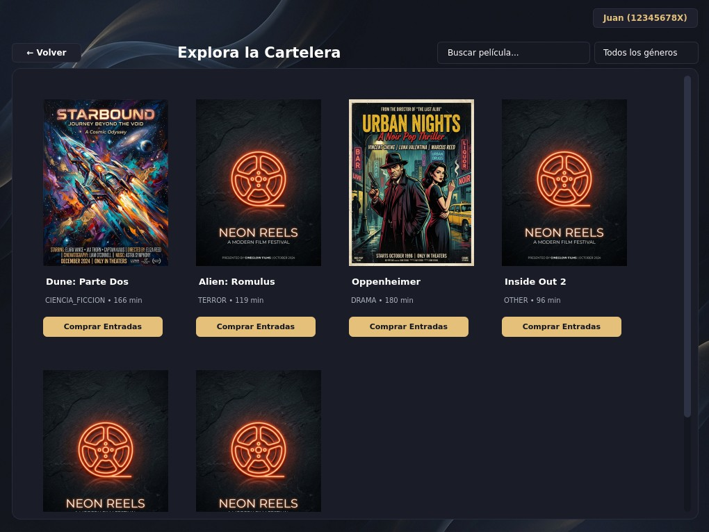
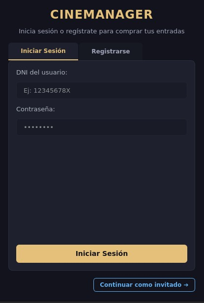
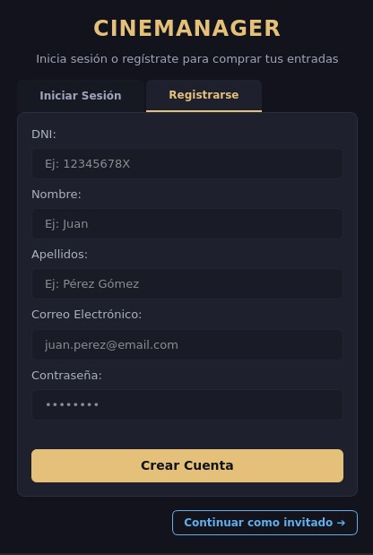
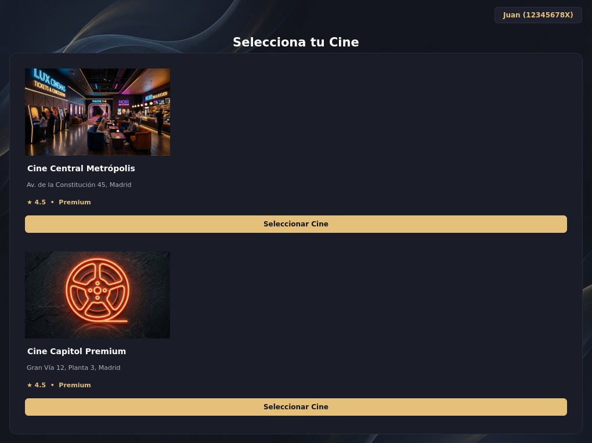
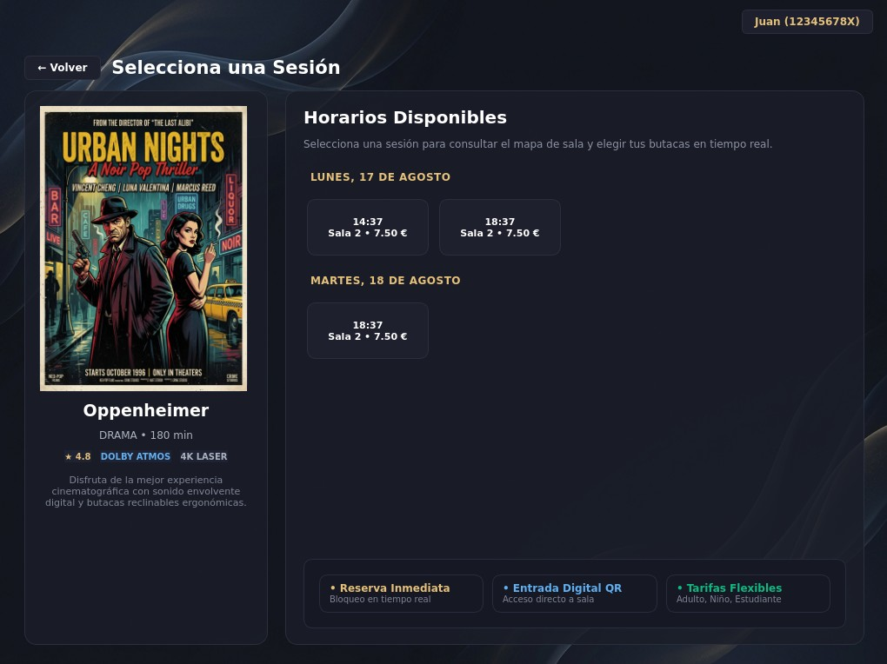
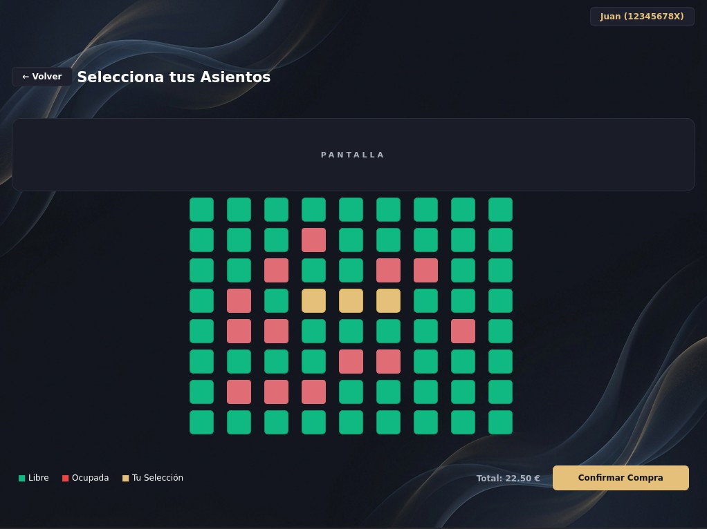
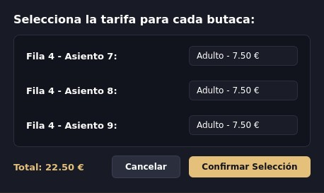
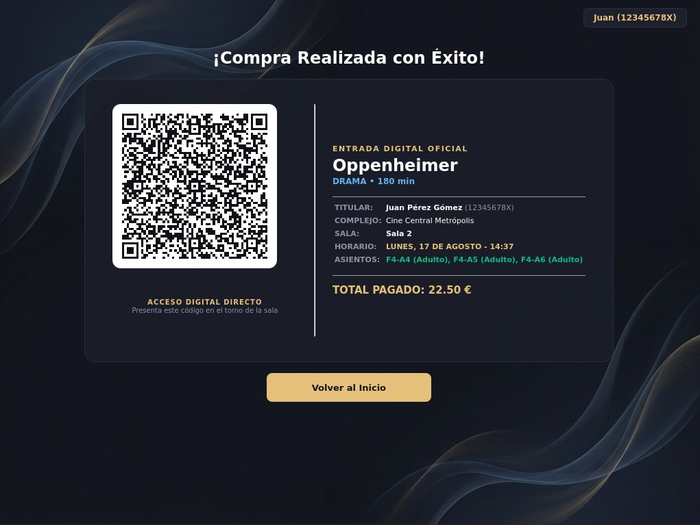
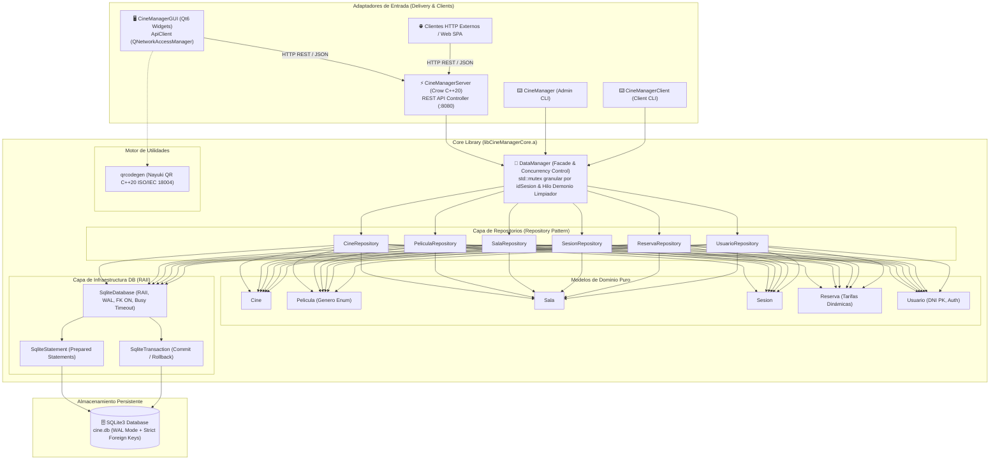

<div align="center">

# 🎬 CineManager

### **Sistema Transaccional de Taquilla & Microservicio REST API en C++20**

*Plataforma integral de alto rendimiento para gestión de complejos cinematográficos, reserva concurrente de butacas en tiempo real, backend asíncrono y cliente nativo Qt6.*

<br/>

[](https://en.cppreference.com/w/cpp/20)
[](https://www.qt.io/)
[](https://crowcpp.org/)
[](https://www.sqlite.org/)
[](https://www.docker.com/)
[](https://github.com/features/actions)
[](https://github.com/google/googletest)
[](LICENSE)

<br/>

<!-- Showcase Hero Banner -->
<p align="center">
  
</p>

<br/>

| ⚡ **C++20 Core** | 🖥️ **Qt6 Desktop** | 🚀 **Crow REST API** | 🔒 **Zero-Collisions** | 🎫 **ISO QR Code** |
| :---: | :---: | :---: | :---: | :---: |
| Librería estática desacoplada | Tema oscuro moderno y asíncrono | Microservicio web `:8080` | Mutex por sesión + SQLite WAL | Motor vectorial Nayuki C++20 |

<br/>

[🚀 Comenzar (Quickstart)](#-guía-rápida-de-despliegue) • [📸 Showcase Visual](#-showcase-visual) • [🏗️ Arquitectura](#-arquitectura-del-sistema) • [📡 REST API](#-catálogo-de-endpoints-rest-api) • [📖 Documentación Técnica](docs/dev_documentation.md) • [🗺️ Roadmap](docs/roadmap.md)

</div>

---

## 📌 Visión General

**CineManager ** es una solución integral y desacoplada de taquilla y gestión de multicines diseñada bajo estándares profesionales de ingeniería de software en **C++20**. El sistema combina un núcleo de dominio transaccional compilado como librería estática independiente (`libCineManagerCore.a`), un microservicio backend RESTful asíncrono impulsado por **Crow C++**, y una aplicación de escritorio moderna desarrollada con **Qt6 (Widgets & Network)**.

El motor transaccional aborda problemas complejos de concurrencia y contención en la reserva de butacas mediante un esquema de **exclusión mutua fina (*fine-grained locking*)** por identificador de sesión, transacciones ACID en **SQLite3 con modo Write-Ahead Logging (WAL)** y un hilo demonio supervisor con mecanismos de *timeout* y liberación automática de bloqueos temporales.

---

## 📸 Showcase Visual

Flujo de usuario completo capturado directamente desde la aplicación de escritorio **CineManagerGUI** (Qt6, tema oscuro):

---

### 🔐 1. Autenticación — Login por DNI y Registro de Cuenta

| Iniciar Sesión | Registrar Cuenta |
|:-:|:-:|
|  |  |

*Autenticación segura por DNI con contraseña. Dispone de dos pestañas: inicio de sesión y registro. La opción **Continuar como invitado** permite navegar sin registrarse hasta la hora de la compra que vuelve a salir la pantalla.*

---

### 🎬 2. Selección de Cine y Cartelera de Películas

| Selección de Cine | Explorar Cartelera |
|:-:|:-:|
|  |  |

*Tarjetas interactivas `CineCardWidget` y `MovieCardWidget` con búsqueda en tiempo real y filtrado por género (`ACCION`, `DRAMA`, `CIENCIA_FICCION`, `TERROR`, etc.).*

> 🤖 **Nota:** Las imágenes de portada de los complejos de cine y los carteles de las películas mostrados en la aplicación han sido **generados con Inteligencia Artificial** con fines demostrativos.

---

### 📅 3. Elección de Horario y Mapa de Butacas

| Selección de Sesión | Mapa Interactivo de Sala |
|:-:|:-:|
|  |  |

*Sesiones agrupadas cronológicamente por día. El mapa de sala muestra en tiempo real butacas **Libres** 🟢, **Ocupadas** 🔴 y **Tu Selección** 🟡. Selección múltiple implementada con `std::set`.*

---

### 🎟️ 4. Selección de Tarifa y Ticket con Código QR Real

| Diálogo de Tarifas Dinámicas | Ticket con QR Escaneable |
|:-:|:-:|
|  |  |

*`TarifasDialog` calcula el precio por butaca (Adulto 7,50 €, Niño 5,00 €, Jubilado/Estudiante 5,50 €). El ticket incluye todos los datos de la compra y un **código QR real** generado algorítmicamente bajo estándar ISO/IEC 18004 (motor *Nayuki C++20*), listo para escanear.*

---

### ⚠️ 5. Gestión de Errores — Servidor No Disponible

<div align="center">


</div>

*Cuando `CineManagerServer` no está activo, la GUI muestra un diálogo informativo con las instrucciones de arranque (vía Docker Compose o ejecución nativa).*

---

## 🚀 Características Principales

| Módulo | Descripción Técnica |
| :--- | :--- |
| **Arquitectura Hexagonal** | Separación estricta entre el núcleo de negocio (`libCineManagerCore.a`), adaptadores de entrada (GUI Qt6, REST API Crow, CLI) y adaptadores de infraestructura (SQLite3). |
| **Control Fino de Concurrencia** | Bloqueo granular mediante `std::unordered_map<int, std::shared_ptr<std::mutex>>` por sesión, evitando cuellos de botella globales en compras concurrentes. |
| **Transacciones ACID & WAL** | Persistencia sobre SQLite3 con `PRAGMA foreign_keys = ON;` y `PRAGMA journal_mode = WAL;`, garantizando atomicidad mediante `SqliteTransaction` (commit/rollback). |
| **Backend REST API Asíncrono** | Microservicio web C++20 con Crow Framework en puerto `8080`, serialización JSON nativa y catálogo formal OpenAPI 3.0. |
| **Cliente Gráfico Qt6 Reactivo** | Interfaz de usuario desacoplada que consume el backend de forma asíncrona mediante `QNetworkAccessManager` y callbacks `std::function`. |
| **Generación Vectorial de QR** | Integración del motor matemático C++20 *Nayuki QR Code Generator* (ISO/IEC 18004) con renderizado libre de artefactos o difuminado mediante interpolación *Nearest-Neighbor*. |
| **Suite GoogleTest & CI/CD** | 100% de cobertura en pruebas de integración, autenticación, restricciones de unicidad y estrés de concurrencia bajo GitHub Actions. |
| **Contenerización Docker** | `Dockerfile` multietapa optimizado con imagen final mínima y orquestación reproducible en un comando mediante `docker-compose.yml`. |

---

## 🏗️ Arquitectura del Sistema



---

## 🧰 Pila Tecnológica

| Componente | Tecnología / Librería | Versión | Rol en el Proyecto |
| :--- | :--- | :---: | :--- |
| **Lenguaje Core** | C++ Standard | `C++20` | Lenguaje de programación base con semántica de movimiento, `std::jthread` y `std::string_view`. |
| **Motor Gráfico** | Qt Framework | `6.x` | Capa de presentación de escritorio (`QtWidgets`, `QtGui`, `QNetwork`). |
| **Framework Web** | Crow C++ | `1.x` | Microservicio REST API asíncrono y enrutador HTTP de alto rendimiento. |
| **Motor de Red** | Asio C++ | `1.30+` | I/O asíncrono *standalone* sin dependencias pesadas de Boost. |
| **Base de Datos** | SQLite3 | `3.x` | Motor relacional embebido con Journal WAL y claves foráneas activas. |
| **Generador QR** | Nayuki QR Engine | `C++20` | Generación algorítmica de matrices QR bajo norma ISO/IEC 18004. |
| **Testing** | GoogleTest / CTest | `1.14.0` | Framework de pruebas unitarias, aserciones y tests de estrés concurrente. |
| **Sistema de Build** | CMake + Ninja | `3.20+` | Configuración modular y compilación paralela multiplataforma. |
| **Contenedores** | Docker & Compose | `3.8` | Construcción multietapa y despliegue orquestado con volúmenes locales. |

---

## 📡 Catálogo de Endpoints REST API

> 📄 **Definición Formal OpenAPI 3.0**: La especificación interactiva completa está documentada en [`docs/openapi.yaml`](docs/openapi.yaml).

| Método | Endpoint | Descripción | Payload Request (JSON) | Código Exitoso |
| :---: | :--- | :--- | :--- | :---: |
| `GET` | `/api/v1/health` | Estado del microservicio y versión de compilación | *Ninguno* | `200 OK` |
| `GET` | `/api/v1/cines` | Listado completo de complejos de cine registrados | *Ninguno* | `200 OK` |
| `GET` | `/api/v1/peliculas` | Cartelera global o filtrada por complejo (`?cine_id=1`) | *Ninguno* | `200 OK` |
| `GET` | `/api/v1/sesiones` | Sesiones enriquecidas filtradas (`?cine_id=1&pelicula_id=2`) | *Ninguno* | `200 OK` |
| `POST` | `/api/v1/auth/login` | Validación de credenciales de usuario por DNI | `{"dni": "...", "password": "..."}` | `200 OK` |
| `POST` | `/api/v1/auth/register` | Registro de nuevos usuarios con rol `CLIENTE` | `{"dni": "...", "nombre": "...", ...}` | `201 Created` |
| `POST` | `/api/v1/reservas` | Creación atómica transaccional de reservas de butacas | `{"sesion_id": 1, "reservas": [...]}` | `201 Created` |

---

## ⚡ Guía Rápida de Despliegue (Quickstart)

### 📋 Requisitos Previos del Sistema
- **Compilador C++:** GCC 11+, Clang 13+ o MSVC 2022 con soporte completo de C++20.
- **Herramientas de Construcción:** CMake 3.20+ y Ninja / Make.
- **Dependencias del Sistema (Debian/Ubuntu):**
  ```bash
  sudo apt-get update && sudo apt-get install -y \
      build-essential cmake ninja-build libsqlite3-dev qt6-base-dev sqlite3 curl
  ```
- **Docker Engine & Docker Compose:** *(Opcional, para ejecución contenerizada)*.

---

### Opción 1: Despliegue en 1 Clic con Docker Compose (Servidor REST)

Es la vía recomendada para poner en marcha el backend de producción sin instalar dependencias locales:

```bash
# 1. Clonar el repositorio
git clone https://github.com/jorgebd21/CineManager.git
cd CineManager

# 2. Levantar el servicio en segundo plano (compilación multietapa + seed inicial)
docker compose up -d --build

# 3. Comprobar estado operativo
curl -s http://localhost:8080/api/v1/health | jq .

# 4. Inspeccionar logs en vivo
docker compose logs -f

# 5. Detener el contenedor
docker compose down
```

> 🖥️ **Ejecución de la Interfaz Gráfica (GUI) en Docker (Permisos X11 / Pantalla):**  
> Si compilas o ejecutas la aplicación de escritorio (`CineManagerGUI`) dentro de un contenedor Docker en Linux y deseas proyectar la ventana en la pantalla del host, debes otorgar permisos al servidor gráfico X11 antes de lanzar el contenedor:
>
> ```bash
> # 1. Conceder permisos de acceso al servidor X11 local para Docker
> xhost +local:docker
> # (Alternativa para acceso local de root): xhost +local:root
>
> # 2. Ejecutar el contenedor compartiendo el socket X11 y la variable DISPLAY
> docker run -it --rm \
>   -e DISPLAY=$DISPLAY \
>   -v /tmp/.X11-unix:/tmp/.X11-unix:rw \
>   -v ./data:/app/data \
>   cinemanager /app/bin/CineManagerGUI
>
> # 3. (Opcional) Revocar los permisos de acceso al finalizar la sesión
> xhost -local:docker
> ```

---

### Opción 2: Compilación y Ejecución Nativa con CMake

#### 1. Configurar y Compilar Todos los Objetivos
```bash
# Configuración del proyecto en modo Release con Ninja o Make
cmake -B build -S . -DCMAKE_BUILD_TYPE=Release
cmake --build build -j$(nproc)
```

#### 2. Inicializar la Base de Datos SQLite (Seed Data)
```bash
# Generar la base de datos relacional con esquema y datos de prueba
mkdir -p data
sqlite3 data/cine.db < data/db_init.sql
```

#### 3. Ejecutar la Aplicación Gráfica de Escritorio (Qt6 GUI)
```bash
./build/bin/CineManagerGUI
```

#### 4. Ejecutar el Servidor REST API Local
```bash
./build/bin/CineManagerServer
```

#### 5. Ejecutar la Suite Completa de Tests Automatizados (GoogleTest)
```bash
ctest --test-dir build --output-on-failure
```

---

### Opción 3: Entorno de Desarrollo con Sanitizers (`build.sh`)

Para sesiones interactivas de depuración con detección dinámica de *memory leaks*, *buffer overflows* o carreras de datos:

```bash
# Compilar y ejecutar pruebas con AddressSanitizer (ASan) y UndefinedBehaviorSanitizer (UBSan)
./build.sh

# Ejecutar análisis exhaustivo con Valgrind
./build.sh --valgrind
```

---

## 📂 Estructura del Repositorio

```text
CineManager/
├── apps/
│   ├── console/              # Aplicaciones CLI (Administrador y Taquilla Cliente)
│   │   ├── app/              # main_admin.cpp y main_client.cpp
│   │   ├── include/          # Controladores y vistas de terminal
│   │   └── src/              # Implementación de lógica de consola
│   ├── gui/                  # Aplicación de escritorio Qt6 (CineManagerGUI)
│   │   ├── app/              # main_gui.cpp (punto de entrada GUI)
│   │   ├── include/          # Headers (ApiClient, MainWindow, CardWidgets, Dialogs)
│   │   ├── src/              # Implementación cliente Qt6 y renderizador QR
│   │   └── ui/               # Formularios Qt Designer (.ui) y hojas de estilo (style.qss)
│   └── server/               # Microservicio Web REST API (CineManagerServer)
│       ├── app/              # main_server.cpp (arranque de Crow C++)
│       ├── include/          # api_controller.hpp
│       └── src/              # api_controller.cpp (definición de rutas y endpoints)
├── core/                     # Librería Estática Core (libCineManagerCore.a)
│   ├── include/
│   │   ├── db/               # Gestor de base de datos RAII, Facade y Repositorios
│   │   ├── models/           # Entidades de dominio (Cine, Pelicula, Sala, Sesion, Reserva, Usuario)
│   │   └── utils/            # Generador QR Nayuki C++20 (qrcodegen.hpp)
│   └── src/                  # Implementación del dominio, repositorios y persistencia
├── data/                     # Base de datos y scripts de sembrado
│   ├── db_init.sql           # Script DDL/DML de inicialización y datos de prueba
│   └── images/               # Carteles de películas y fotos de complejos
├── docs/                     # Suite de Documentación Técnica y Comercial
│   ├── assets/               # Capturas de pantalla, diagramas y demostraciones GIF
│   ├── dev_documentation.md  # Especificación de ingeniería y arquitectura interna 
│   ├── openapi.yaml          # Especificación formal OpenAPI 3.0 (Swagger / Postman)
│   └── roadmap.md            # Roadmap completado de la y visión estratégica 
├── tests/                    # Suite de Pruebas Unitarias y de Concurrencia GoogleTest
├── .github/workflows/        # Pipeline de Integración Continua (GitHub Actions CI)
├── CMakeLists.txt            # Script maestro de compilación CMake
├── Dockerfile                # Receta Dockerfile multietapa (Builder & Runner)
├── docker-compose.yml        # Orquestación del microservicio REST API
└── README.md                 # Portada principal del proyecto
```

---

## 📚 Documentación Técnica Adicional

- 📖 [Documentación Técnica de Desarrollo (`docs/dev_documentation.md`)](docs/dev_documentation.md): Detalles de concurrencia, ciclo de vida de transacciones, arquitectura interna y changelog consolidado.
- 🌐 [Especificación OpenAPI 3.0 (`docs/openapi.yaml`)](docs/openapi.yaml): Contrato formal REST para clientes web, móviles y herramientas de prueba de APIs.
- 🗺️ [Roadmap de Fases y Visión Futura (`docs/roadmap.md`)](docs/roadmap.md): Registro de hitos cumplidos  y backlog estratégico para la versión 3.0.
- 🖼️ [Índice de Assets Visuales (`docs/assets/README.md`)](docs/assets/README.md): Catálogo de todas las capturas de pantalla, su descripción y directrices de contribución para nuevos recursos multimedia.

---

## 📄 Licencia

Este proyecto se distribuye bajo los términos de la licencia **MIT**. Para más detalles, consulte el archivo oficial [LICENSE](LICENSE).

---

<div align="center">
  <sub>Desarrollado con pasión por <strong>Jorge Baeza Diaz</strong> · 2026</sub>
</div>
