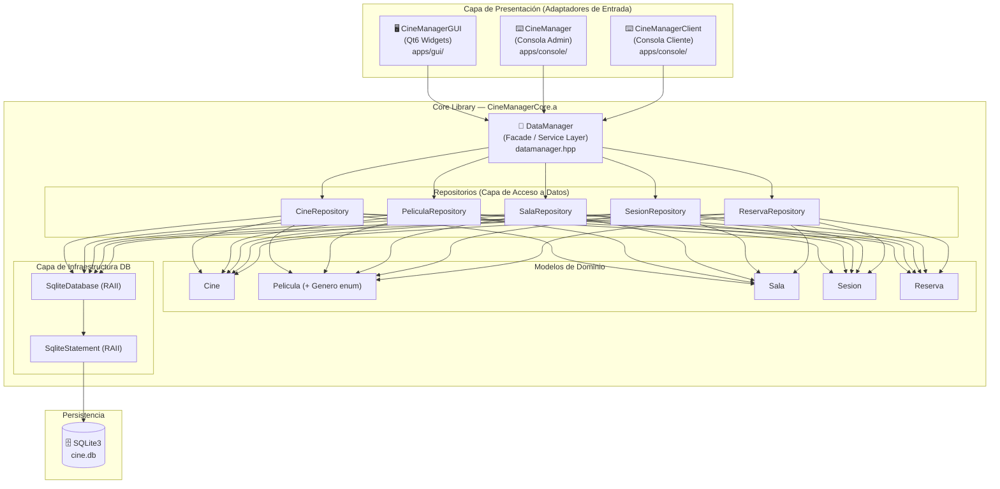
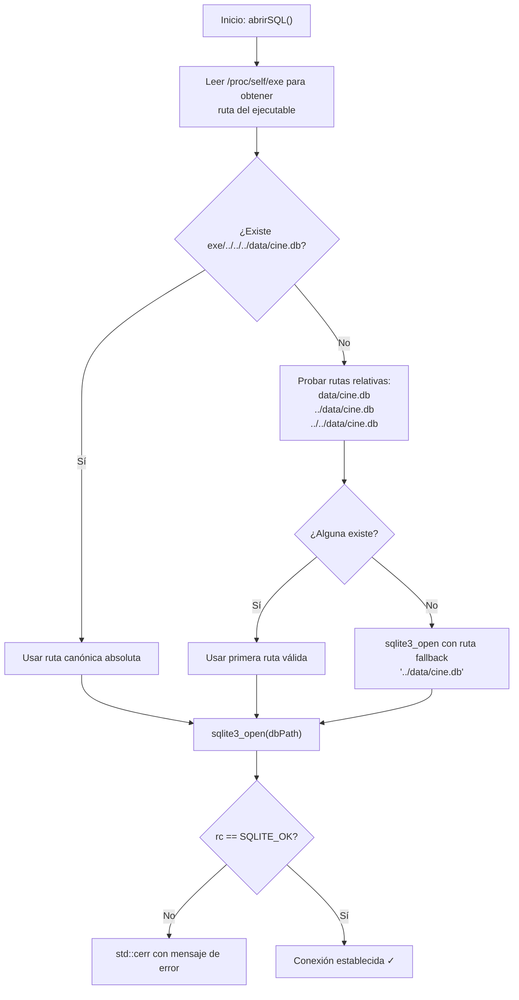
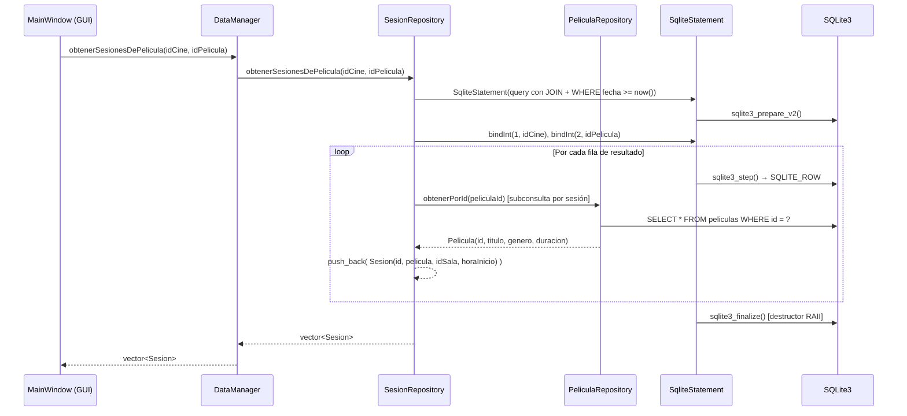
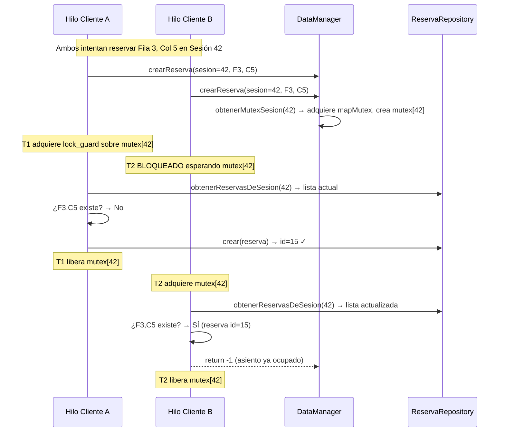
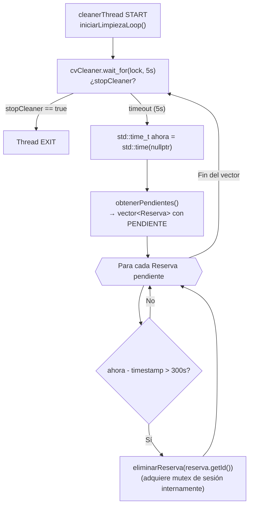
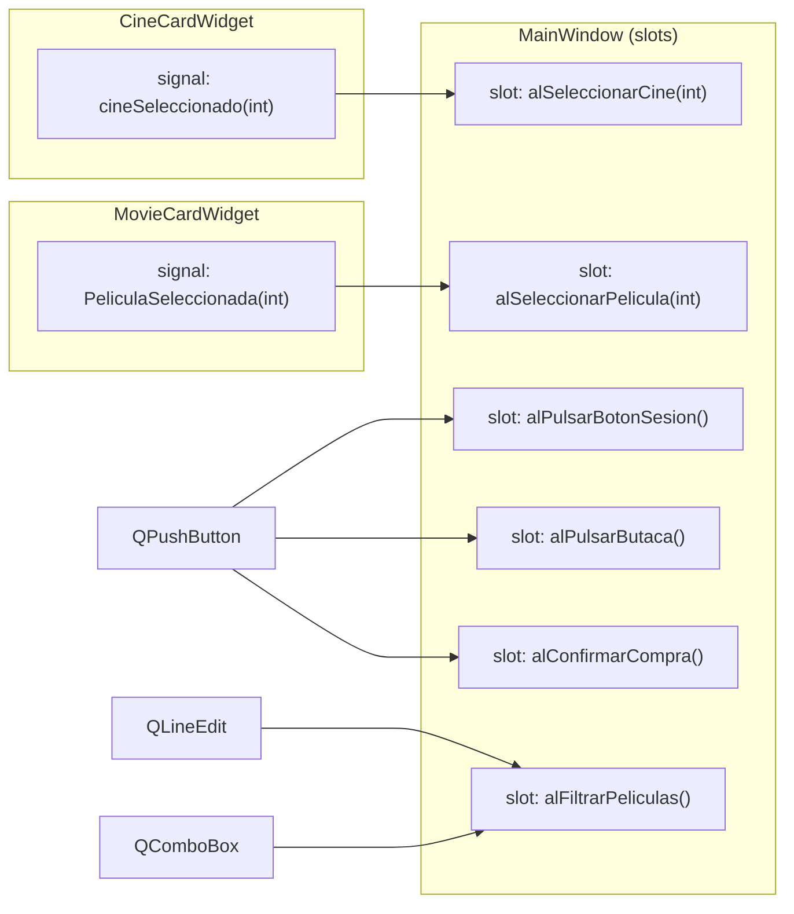

# CineManager — Documentación Técnica de Desarrollo

> **Versión del documento:** 1.0 · **Fecha:** Julio 2026  
> **Proyecto:** CineManager v2.0 · **Lenguaje:** C++17 · **Build:** CMake + Ninja + Clang

---

## Tabla de Contenidos

1. [Visión General de la Arquitectura](#1-visión-general-de-la-arquitectura)
2. [Capa de Dominio — Core Library](#2-capa-de-dominio--core-library)
3. [Capa de Persistencia — Repositorios y SQLite](#3-capa-de-persistencia--repositorios-y-sqlite)
4. [Fachada de Datos — DataManager](#4-fachada-de-datos--datamanager)
5. [Sistema de Concurrencia y Expiración de Reservas](#5-sistema-de-concurrencia-y-expiración-de-reservas)
6. [Capa de Presentación — Interfaz Gráfica (Qt6)](#6-capa-de-presentación--interfaz-gráfica-qt6)
7. [Capa de Presentación — Interfaz de Consola](#7-capa-de-presentación--interfaz-de-consola)
8. [Guía de Setup y Compilación](#8-guía-de-setup-y-compilación)
9. [Deuda Técnica Identificada](#9-deuda-técnica-identificada)

---

## 1. Visión General de la Arquitectura

CineManager implementa un patrón de **Arquitectura Hexagonal** (también llamada *Ports & Adapters*), donde el núcleo de la aplicación (`CineManagerCore`) está completamente desacoplado de sus adaptadores de entrada. Esta separación se materializa a nivel de compilación en una **librería estática independiente** (`CineManagerCore.a`).

### 1.1 Diagrama de Capas



### 1.2 Estructura de Directorios

```
CineManager/
├── CMakeLists.txt          # Build system unificado
├── build.sh                # Script de automatización (ASan/Valgrind)
├── core/                   # ← Librería estática CineManagerCore
│   ├── include/
│   │   ├── db/
│   │   │   ├── database.hpp          # SqliteDatabase + SqliteStatement
│   │   │   ├── datamanager.hpp       # Facade principal (API pública del core)
│   │   │   └── repositories/
│   │   │       ├── cinerepository.hpp
│   │   │       ├── pelicularepository.hpp
│   │   │       ├── salarepository.hpp
│   │   │       ├── sesionrepository.hpp
│   │   │       └── reservarepository.hpp
│   │   └── models/
│   │       ├── asiento.hpp
│   │       ├── cine.hpp
│   │       ├── pelicula.hpp  # Incluye enum Genero
│   │       ├── sala.hpp
│   │       ├── sesion.hpp    # Contiene Pelicula embebida (composición)
│   │       └── reserva.hpp   # Incluye std::time_t timestampCreacion
│   └── src/                  # Implementaciones espejo de include/
├── apps/
│   ├── console/              # Adaptadores CLI
│   │   ├── app/main_admin.cpp
│   │   ├── app/main_client.cpp
│   │   ├── include/          # Controladores de consola
│   │   └── src/
│   └── gui/                  # Adaptador Qt6 Widgets
│       ├── app/main_gui.cpp
│       ├── include/
│       │   ├── mainwindow.h
│       │   ├── cinecardwidget.h
│       │   └── moviecardwidget.h
│       ├── src/
│       │   ├── mainwindow.cpp  (434 líneas — lógica principal de la GUI)
│       │   ├── cinecardwidget.cpp
│       │   └── moviecardwidget.cpp
│       └── ui/
│           ├── mainwindow.ui   (602 líneas — layout Qt Designer)
│           └── style.qss       (194 líneas — tema visual dark)
└── data/
    ├── cine.db               # Base de datos SQLite (ignorada por .gitignore)
    └── images/               # Assets de imagen para la GUI
```

---

## 2. Capa de Dominio — Core Library

### 2.1 Modelos de Entidad

Los modelos son clases C++ puras (*Plain Old Data* con encapsulación), sin dependencia alguna de framework externo.

| Entidad | Atributos clave | Relaciones |
|---------|----------------|------------|
| `Cine` | `id`, `nombre`, `direccion` | Tiene `Sala`s |
| `Sala` | `id`, `cineId`, `numeroSala`, `filas`, `columnas` | Pertenece a `Cine` |
| `Pelicula` | `id`, `titulo`, `Genero` (enum), `duracion` | Proyectada en `Sesion` |
| `Sesion` | `id`, `Pelicula` (composición), `idSala`, `horaInicio` (`time_t`) | Une `Pelicula` + `Sala` |
| `Reserva` | `id`, `idSesion`, `fila`, `columna`, `estado`, `timestampCreacion` | Pertenece a `Sesion` |

> **Nota de diseño:** `Sesion` contiene un objeto `Pelicula` por valor (composición), no solo un `peliculaId`. Esto significa que cada `Sesion` hidrata su película desde la DB al ser cargada. Es un trade-off deliberado: simplicidad de acceso vs. posible N+1 en consultas masivas.

### 2.2 El Enum `Genero`

```cpp
enum class Genero {
  NONE, ACCION, COMEDIA, DRAMA, TERROR,
  CIENCIA_FICCION, ROMANCE, DOCUMENTAL, OTHER
};
```

Acompañado de tres funciones auxiliares globales (`intToGenero`, `stringToGenero`, `generoToString`) definidas en `pelicula.hpp`/`.cpp` para serialización/deserialización desde SQLite y la GUI.

### 2.3 Estados de `Reserva`

El campo `estado` es un `std::string` libre, pero el sistema reconoce los siguientes valores semánticos:

| Estado | Origen | Significado |
|--------|--------|-------------|
| `"PENDIENTE"` | Consola (flujo de cliente) | Reserva temporal, sujeta a expiración |
| `"COMPRADO"` | GUI (botón "Confirmar Compra") | Reserva confirmada y pagada |
| `"ANALIZANDO"` | Hilo limpiador interno | Estado efímero durante el ciclo de limpieza |

---

## 3. Capa de Persistencia — Repositorios y SQLite

### 3.1 Wrappers RAII sobre SQLite C API

La clase `SqliteDatabase` encapsula el ciclo de vida de la conexión SQLite:

```cpp
class SqliteDatabase {
  sqlite3* db;
public:
  SqliteDatabase() { abrirSQL(); }  // Constructor → sqlite3_open()
  ~SqliteDatabase() { cerrarSQL(); } // Destructor  → sqlite3_close()
  sqlite3* getDb() const { return db; }
};
```

La clase `SqliteStatement` encapsula el ciclo de vida de un *prepared statement*:

```cpp
class SqliteStatement {
  sqlite3_stmt* stmt;
public:
  SqliteStatement(sqlite3* db, const std::string& query); // sqlite3_prepare_v2()
  ~SqliteStatement() { sqlite3_finalize(stmt); }          // RAII automático
  bool bindInt(int index, int value);
  bool bindText(int index, const std::string& value);
  int step();
  int getColumnInt(int index);
  std::string getColumnText(int index);
};
```

> **Protección frente a null:** `getColumnText()` verifica explícitamente `sqlite3_column_text() != nullptr` antes de construir el `std::string`, evitando UB al leer columnas NULL.

### 3.2 Resolución de Ruta de la Base de Datos

La lógica de `abrirSQL()` implementa un sistema de detección de ruta multi-fallback:



> ⚠️ **Deuda técnica:** Este heurístico es frágil. La ruta correcta depende del CWD en tiempo de ejecución. Ver [Sección 9](#9-deuda-técnica-identificada).

### 3.3 Patrón Repository

Cada repositorio sigue una interfaz CRUD estándar:

```
crear(const T&) → int          // Retorna el ID generado (rowid) o -1 en fallo
obtenerPorId(int id) → T       // Retorna un objeto "nulo" con id=-1 si no existe
obtenerTodos() → vector<T>
actualizar(int id, const T&) → bool
eliminar(int id) → bool
```

Además, algunos repositorios exponen consultas especializadas con JOINs:

| Repositorio | Consulta especializada | SQL relevante |
|-------------|----------------------|---------------|
| `PeliculaRepository` | `obtenerCartelera(int idCine)` | JOIN con `sesiones` y `salas` |
| `SesionRepository` | `obtenerSesionesDePelicula(idCine, idPelicula)` | Filtra `fecha_hora >= datetime('now')` |
| `SesionRepository` | `obtenerSesionesDeCine(idCine)` | JOIN `sesiones` ↔ `salas` |
| `ReservaRepository` | `obtenerPorSesion(int idSesion)` | WHERE `sesion_id = ?` |
| `ReservaRepository` | `obtenerPendientes()` | WHERE `estado = 'PENDIENTE'` |

### 3.4 Flujo de una Consulta: `obtenerSesionesDePelicula`



> **N+1 implícito:** Por cada sesión en el resultado, se ejecuta una subconsulta adicional para hidratar la `Pelicula`. Para carteles con pocas sesiones (caso típico), el impacto es mínimo. En escenarios con cientos de sesiones, sería conveniente un JOIN que traiga los campos de película en una sola query.

---

## 4. Fachada de Datos — DataManager

`DataManager` es el único punto de acceso al Core desde cualquier adaptador externo. Actúa como **Service Layer / Facade**, ocultando la existencia de los repositorios individuales.

### 4.1 Composición Interna

```cpp
class DataManager {
private:
  static constexpr int TIEMPO_EXPIRACION_SEGUNDOS = 300;  // 5 minutos

  SqliteDatabase db;                  // Una sola conexión SQLite compartida

  // --- Concurrencia ---
  std::unordered_map<int, std::unique_ptr<std::mutex>> sessionMutexes;
  std::mutex mapMutex;                // Protege el acceso al mapa de mutexes
  std::thread cleanerThread;
  std::atomic<bool> stopCleaner{false};
  std::condition_variable cvCleaner;
  std::mutex cvMutex;

  // --- Repositorios (todos comparten la misma SqliteDatabase&) ---
  CineRepository    cineRepo;
  PeliculaRepository peliculaRepo;
  SalaRepository    salaRepo;
  SesionRepository  sesionRepo;
  ReservaRepository reservaRepo;
};
```

El constructor inicializa todos los repositorios pasando la **misma referencia** a `SqliteDatabase`, garantizando que todas las operaciones ocurren sobre una única conexión SQLite.

### 4.2 Ciclo de Vida del DataManager

```mermaid
stateDiagram-v2
    [*] --> Inicializando : DataManager()
    Inicializando --> Activo : SqliteDatabase::abrirSQL() OK\ncleanerThread lanzado
    Activo --> Activo : Operaciones CRUD (create/read/update/delete)
    Activo --> Destruyendo : ~DataManager()
    Destruyendo --> [*] : stopCleaner=true\ncvCleaner.notify_all()\ncleanerThread.join()\nSqliteDatabase::cerrarSQL()
```

---

## 5. Sistema de Concurrencia y Expiración de Reservas

Este es el componente más sofisticado técnicamente del proyecto. Implementa dos mecanismos complementarios de protección de concurrencia.

### 5.1 Mutexes por Sesión (Fine-Grained Locking)

En lugar de usar un único mutex global (que crearía un cuello de botella severo), el sistema usa **un mutex por `idSesion`**, almacenados en un mapa hash:

```cpp
std::unordered_map<int, std::unique_ptr<std::mutex>> sessionMutexes;
std::mutex mapMutex;  // Mutex de segundo nivel para proteger el propio mapa
```

El método `obtenerMutexSesion(int idSesion)` implementa una creación perezosa (*lazy initialization*) del mutex:

```cpp
std::mutex& DataManager::obtenerMutexSesion(int idSesion) {
    std::lock_guard<std::mutex> cerrojo(mapMutex);  // ① Bloqueo del mapa
    if (sessionMutexes.find(idSesion) == sessionMutexes.end()) {
        sessionMutexes[idSesion] = std::make_unique<std::mutex>(); // ② Creación lazy
    }
    return *sessionMutexes[idSesion];  // ③ Retorna referencia al mutex de esa sesión
}
```

### 5.2 Flujo de Creación de Reserva (Thread-Safe)



> **Propiedad de aislamiento:** Dos clientes compitiendo por la **misma sesión** se serializan sin interferir con reservas de **otras sesiones** (que usan mutexes distintos).

### 5.3 Hilo Limpiador — Expiración de Reservas Temporales

El `cleanerThread` es un hilo daemon que expira automáticamente las reservas en estado `"PENDIENTE"` que superan el umbral de 300 segundos.



**Propiedades del diseño:**
- **No-polling activo:** El hilo usa `condition_variable::wait_for()` en lugar de `sleep()`, lo que permite interrupción inmediata en la destrucción del `DataManager`.
- **Atomicidad de la señal de parada:** `stopCleaner` es `std::atomic<bool>`, eliminando la necesidad de mutex adicional para su lectura/escritura.
- **Destrucción ordenada:** El destructor de `DataManager` establece `stopCleaner = true`, notifica la condition variable y hace `join()` del hilo, garantizando que no hay recursos liberados antes de que el hilo termine.

### 5.4 Tabla de Primitivas de Sincronización

| Primitiva | Variable | Propósito |
|-----------|----------|-----------|
| `std::mutex` | `mapMutex` | Protege escritura/lectura del `unordered_map` de mutexes |
| `std::unique_ptr<std::mutex>` | `sessionMutexes[id]` | Un mutex por sesión (fine-grained locking) |
| `std::mutex` | `cvMutex` | Mutex asociado a la condition variable del limpiador |
| `std::condition_variable` | `cvCleaner` | Permite parada inmediata del hilo limpiador |
| `std::atomic<bool>` | `stopCleaner` | Flag de terminación sin necesidad de mutex |
| `std::thread` | `cleanerThread` | Hilo de limpieza en background |

---

## 6. Capa de Presentación — Interfaz Gráfica (Qt6)

### 6.1 Navegación por QStackedWidget

La GUI implementa un flujo de compra lineal de 5 pantallas navegables mediante un `QStackedWidget` centralizado. El estado de selección se mantiene en `MainWindow` como variables miembro privadas.

```mermaid
stateDiagram-v2
    direction LR
    [*] --> Página0 : launch()

    Página0 : 🏢 Selección de Cine\n(listaCines + CineCardWidget)
    Página1 : 🎬 Cartelera\n(listaPeliculas + MovieCardWidget\nbúsqueda + filtro género)
    Página2 : 🕐 Selección de Sesión\n(poster + sesiones por día)
    Página3 : 💺 Mapa de Sala\n(QGridLayout dinámico de butacas)
    Página4 : 🎟️ Ticket de Compra\n(QR mock + detalles HTML)

    Página0 --> Página1 : CineCardWidget::cineSeleccionado(id)
    Página1 --> Página2 : MovieCardWidget::PeliculaSeleccionada(id)
    Página2 --> Página3 : QPushButton sesión clicked
    Página3 --> Página4 : botonConfirmar clicked
    Página4 --> Página0 : botonInicio clicked

    Página1 --> Página0 : botonAtrasPeliculas
    Página2 --> Página1 : botonAtrasSesiones
    Página3 --> Página2 : botonAtrasSala
```

### 6.2 Arquitectura de Señales y Slots



### 6.3 Widgets Personalizados

#### `CineCardWidget`
Widget de tarjeta para cada cine en la lista. Estructura visual:
- `QLabel` con imagen `data/images/cines/{id}.jpg` (fallback a `default.jpg`) — 250×150px
- `QLabel` con nombre del cine (bold, 14px, blanco)
- `QLabel` con dirección (11px, `#abb2bf`)
- `QLabel` estático con "⭐ 4.5 • Premium" (`#00f0b5`) ← *hardcodeado*
- `QPushButton` "SELECT" con estilo teal (`#00f0b5`)

[🖼️ INSERTAR CAPTURA DE PANTALLA: Página 0 — Lista de cines con CineCardWidget]

#### `MovieCardWidget`
Widget de tarjeta para cada película en la cartelera. Estructura visual:
- `QLabel` con póster `data/images/peliculas/{id}.jpg` (fallback a `default.jpg`) — 180×240px
- `QLabel` con título (bold, 13px, blanco)
- `QLabel` con `"{genero} • {duracion} min"` (10px, `#abb2bf`)
- `QPushButton` "BOOK TICKETS" (teal, bold)

[🖼️ INSERTAR CAPTURA DE PANTALLA: Página 1 — Cartelera con MovieCardWidget y filtros]

### 6.4 Mapa de Sala Dinámico (Página 3)

El mapa de butacas se genera completamente en código en `alSeleccionarSesionPorId()`:

```
Lógica de dimensionado dinámico:
  sizeW = 500 / columnas
  sizeH = 300 / filas
  butacaSize = min(sizeW, sizeH)
  butacaSize = clamp(butacaSize, 12, 35)  // Entre 12px y 35px
```

Cada botón-butaca tiene:
- `setObjectName("botonButaca")` → permite targeting en QSS
- `setCheckable(true)` → estado checked = seleccionada
- `setProperty("fila", f)` y `setProperty("columna", c)` → recuperados en el slot
- `setEnabled(false)` si la butaca ya está en `reservas` (aparece en rojo via QSS)
- Tooltip: `"Fila {f+1}, Asiento {c+1}"`
- Límite de seguridad: si `filas * columnas > 500`, se muestra aviso y no se renderiza el grid

[🖼️ INSERTAR CAPTURA DE PANTALLA: Página 3 — Mapa de sala con butacas libres, ocupadas y seleccionadas]

### 6.5 Ticket de Compra (Página 4)

El ticket se renderiza como HTML rico dentro de un `QLabel`:

```html
<p style='color:#00f0b5'>TICKET DE ENTRADA</p>
<p style='font-size:16px; color:#ffffff'>{TÍTULO}</p>
<p style='color:#abb2bf'>{GÉNERO} • {DURACIÓN} min</p>
<hr style='border-top: 1px dashed #3e4452'>
<table>
  <tr><td>CINE:</td><td>{nombre}</td></tr>
  <tr><td>SALA:</td><td>Sala {id}</td></tr>
  <tr><td>SESIÓN:</td><td>{LUNES, DD DE MES - HH:MM}</td></tr>
  <tr><td>ASIENTOS:</td><td>F1-A3, F1-A4, ...</td></tr>
</table>
<p style='color:#00f0b5'>TOTAL COMPRA: {X.XX} €</p>
```

El precio se calcula como `butacasSeleccionadas.size() * 7.50` (hardcodeado).

[🖼️ INSERTAR CAPTURA DE PANTALLA: Página 4 — Ticket de compra con QR mock y detalles]

### 6.6 Sistema de Estilos (QSS)

El tema visual se define en `apps/gui/ui/style.qss`. La paleta de colores sigue un esquema **dark mode** coherente:

| Token visual | Color | Uso |
|---|---|---|
| Fondo principal | `#121418` | `QMainWindow` |
| Superficie de componente | `#1e222b` | `QListWidget`, tarjetas, inputs |
| Borde sutil | `#282c34` / `#3e4452` | Separadores, bordes de input |
| Texto principal | `#ffffff` | Títulos, labels primarios |
| Texto secundario | `#abb2bf` | Metadatos, info secundaria |
| Acento primario (teal) | `#00f0b5` | Botones de acción, selección activa |
| Acento hover (teal oscuro) | `#00d09c` | Estado hover de botones de acción |
| Error / Ocupado | `#e74c3c` | Butacas ocupadas |
| Libre | `#2ecc71` | Butacas libres |

---

## 7. Capa de Presentación — Interfaz de Consola

La consola expone **dos binarios separados** compilados desde el mismo `CONSOLE_SOURCES`:

| Binario | Entry point | Rol |
|---------|------------|-----|
| `CineManager` | `main_admin.cpp` | Gestión completa (CRUD de cines, salas, películas, sesiones) |
| `CineManagerClient` | `main_client.cpp` | Flujo de cliente (explorar cartelera, reservar asientos) |

Ambos instancian un `DataManager` directamente, lo que significa que el `cleanerThread` también se activa en los clientes de consola. El control de concurrencia es idéntico al de la GUI.

---

## 8. Guía de Setup y Compilación

### 8.1 Requisitos del Sistema

```bash
# Dependencias obligatorias
sudo apt install clang cmake ninja-build libsqlite3-dev

# Dependencias opcionales
sudo apt install valgrind

# Para la GUI
sudo apt install qt6-base-dev
```

### 8.2 Análisis del `CMakeLists.txt`

```cmake
cmake_minimum_required(VERSION 3.10)
project(CineManager VERSION 2.0 LANGUAGES CXX)
set(CMAKE_CXX_STANDARD 17)

# ① AddressSanitizer + UBSan activos por defecto
option(ENABLE_ASAN "..." ON)
if(ENABLE_ASAN)
  set(CMAKE_CXX_FLAGS "${CMAKE_CXX_FLAGS} -fsanitize=address -fsanitize=undefined")
endif()

# ② CineManagerCore — librería estática (el Core hexagonal)
add_library(CineManagerCore STATIC ${CORE_SOURCES})
target_include_directories(CineManagerCore PUBLIC core/include)
target_link_libraries(CineManagerCore PUBLIC SQLite::SQLite3)

# ③ Ejecutables CLI — heredan headers y SQLite de CineManagerCore (PUBLIC)
add_executable(CineManager    ${CONSOLE_SOURCES} apps/console/app/main_admin.cpp)
add_executable(CineManagerClient ${CONSOLE_SOURCES} apps/console/app/main_client.cpp)
target_link_libraries(CineManager PRIVATE CineManagerCore)

# ④ GUI Qt6 — AUTOMOC/AUTOUIC/AUTORCC habilitados
set(CMAKE_AUTOMOC ON)   # Procesa Q_OBJECT automáticamente
set(CMAKE_AUTOUIC ON)   # Compila .ui → ui_*.h automáticamente
set(CMAKE_AUTORCC ON)   # Compila .qrc automáticamente
add_executable(CineManagerGUI ${GUI_SOURCES} apps/gui/app/main_gui.cpp)
target_link_libraries(CineManagerGUI PRIVATE CineManagerCore Qt6::Widgets)
```

### 8.3 Análisis del `build.sh`

El script automatiza el ciclo completo de compilación en dos modos:

```
MODO 1: ./build.sh
┌─────────────────────────────────────────────────────────────┐
│ cmake -G Ninja -DCMAKE_BUILD_TYPE=Debug -DENABLE_ASAN=ON    │
│ cmake --build build/  (Ninja paralelo)                       │
│ ./build/bin/CineManager  (binario con ASan/UBSan embebido)  │
└─────────────────────────────────────────────────────────────┘

MODO 2: ./build.sh --valgrind
┌─────────────────────────────────────────────────────────────┐
│ cmake -G Ninja -DCMAKE_BUILD_TYPE=Debug -DENABLE_ASAN=OFF   │
│   (ASan y Valgrind son incompatibles — no pueden coexistir) │
│ cmake --build build/                                         │
│ valgrind --leak-check=full --track-origins=yes CineManager   │
└─────────────────────────────────────────────────────────────┘
```

> **Por qué no pueden coexistir ASan y Valgrind:** AddressSanitizer instrumenta el binario con su propio allocator de memoria y sombras de memoria. Valgrind intercepta las syscalls de malloc/free a un nivel más bajo. Ambas herramientas compiten por el control del heap, produciendo falsos positivos y crashes. Son herramientas complementarias, no alternativas.

### 8.4 Binarios Generados

Tras `cmake --build build/`:

```
build/bin/
├── CineManager          # Consola administrador
├── CineManagerClient    # Consola cliente
└── CineManagerGUI       # Interfaz Qt6
```

### 8.5 DevContainer

El proyecto incluye `.devcontainer/` con configuración Docker para desarrollo en contenedor aislado, útil para CI o para desarrolladores sin el entorno local configurado.

---

## 9. Deuda Técnica Identificada

| # | Componente | Descripción | Severidad |
|---|-----------|-------------|-----------|
| DT-01 | `database.cpp` | Heurístico frágil de resolución de ruta de `cine.db` | 🟡 Media |
| DT-02 | `database.cpp` | No se activa `PRAGMA foreign_keys = ON` — integridad referencial no enforced | 🔴 Alta |
| DT-03 | `database.cpp` | No se activa `PRAGMA journal_mode = WAL` — bajo rendimiento en escrituras concurrentes | 🟡 Media |
| DT-04 | `mainwindow.cpp` | Precio de entrada hardcodeado a 7.50€ en lugar de leerlo del campo `precio_entrada` de la DB | 🟡 Media |
| DT-05 | `main_gui.cpp` | Ruta de `style.qss` relativa al CWD (`"apps/gui/ui/style.qss"`) — frágil si el CWD no es la raíz | 🟡 Media |
| DT-06 | `sesionrepository.cpp` | N+1 queries en `obtenerSesionesDePelicula` — una query por sesión para hidratar Pelicula | 🟢 Baja |
| DT-07 | `cinecardwidget.cpp` | Rating "⭐ 4.5 • Premium" estático — no viene de la base de datos | 🟢 Baja |
| DT-08 | `mainwindow.cpp` | QR generado desde imagen estática `qr_mock.jpg` — no es funcional | 🟢 Baja |
| DT-09 | General | Ausencia total de tests automatizados (unitarios o de integración) | 🔴 Alta |
| DT-10 | `datamanager.cpp` | `eliminarReserva()` hace doble consulta (obtenerReserva + eliminar) — posible TOCTOU | 🟡 Media |

---

*Documento generado a partir de auditoría de código fuente el 19 de julio de 2026.*
