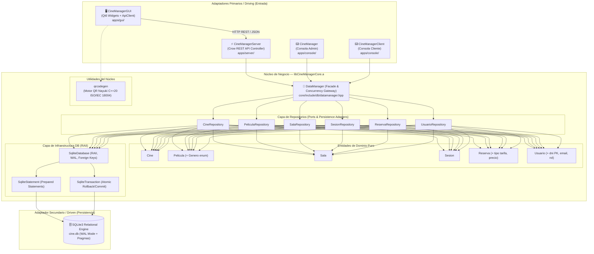
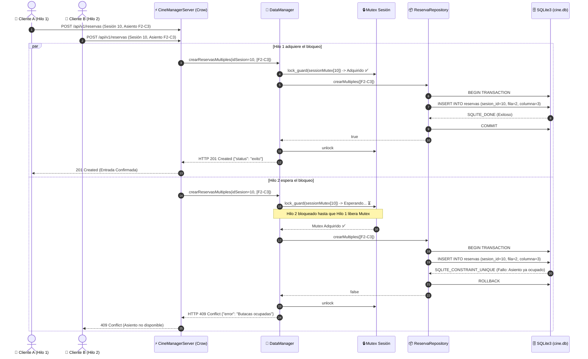
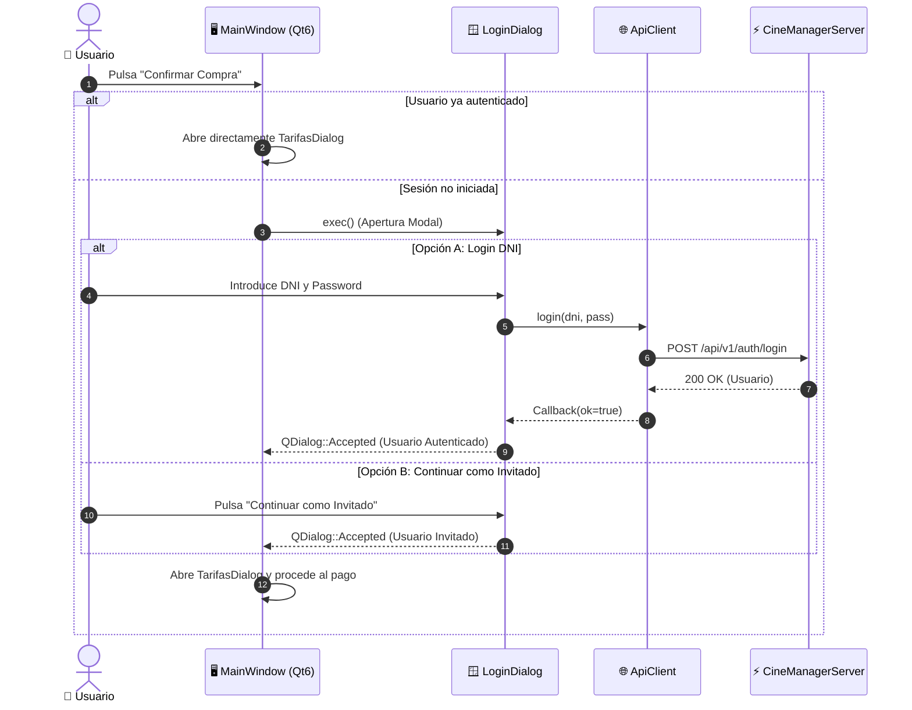

# CineManager — Documentación Técnica y Manual de Arquitectura

> **Proyecto:** CineManager · **Fecha:** 2026  
> **Estado:** Producción Consolidada  
> **Autor:** Jorge Beneyto · **Lenguaje:** C++20 · **Frameworks:** Qt6, Crow C++, SQLite3, GoogleTest  

---

## 📑 Tabla de Contenidos

1. [Visión General y Patrones de Diseño](#1-visión-general-y-patrones-de-diseño)
2. [Capa de Dominio — Modelos Puros C++20](#2-capa-de-dominio--modelos-puros-c20)
3. [Capa de Persistencia — SQLite RAII y Repositorios](#3-capa-de-persistencia--sqlite-raii-y-repositorios)
4. [Fachada Transaccional y Modelo de Concurrencia](#4-fachada-transaccional-y-modelo-de-concurrencia)
   - 4.1 [Exclusión Mutua de Grano Fino (Fine-Grained Locking)](#41-exclusión-mutua-de-grano-fino-fine-grained-locking)
   - 4.2 [Hilo Demonio de Expiración Automática](#42-hilo-demonio-de-expiración-automática)
   - 4.3 [Diagrama de Secuencia: Reserva Concurrente Atómica](#43-diagrama-de-secuencia-reserva-concurrente-atómica)
5. [Capa de Backend Web — Microservicio REST API (Crow C++)](#5-capa-de-backend-web--microservicio-rest-api-crow-c)
   - 5.1 [Especificación de Endpoints y Payloads JSON](#51-especificación-de-endpoints-y-payloads-json)
   - 5.2 [Manejo de Errores y Códigos HTTP](#52-manejo-de-errores-y-códigos-http)
6. [Capa de Presentación — Cliente Gráfico Asíncrono (Qt6)](#6-capa-de-presentación--cliente-gráfico-asíncrono-qt6)
   - 6.1 [Cliente de Red Asíncrono (ApiClient)](#61-cliente-de-red-asíncrono-apiclient)
   - 6.2 [Pasarela de Autenticación y Checkout Gatekeeper](#62-pasarela-de-autenticación-y-checkout-gatekeeper)
   - 6.3 [Generación Vectorial de Código QR (Nayuki Engine)](#63-generación-vectorial-de-código-qr-nayuki-engine)
7. [Suite de Pruebas Automatizadas (GoogleTest)](#7-suite-de-pruebas-automatizadas-googletest)
8. [Infraestructura de Despliegue y CI/CD](#8-infraestructura-de-despliegue-y-cicd)
9. [Registro de Hitos Técnicos y Estabilización](#9-registro-de-hitos-técnicos-y-estabilización)

---

## 1. Visión General y Patrones de Diseño

CineManager implementa una **Arquitectura Hexagonal (Puertos y Adaptadores)** combinada con el **Patrón Repositorio (Repository Pattern)** y el **Patrón Fachada (Facade Pattern)**. La lógica central del negocio y los mecanismos de acceso a datos se encuentran completamente aislados en la librería estática `libCineManagerCore.a`, garantizando que ninguna regla de negocio dependa de la interfaz gráfica (Qt6), del protocolo de red (Crow REST API) ni de la consola de administración.



---

## 2. Capa de Dominio — Modelos Puros C++20

Los modelos de dominio residen en `core/include/models/` y representan el estado del negocio sin acoplamientos externos:

- **`Usuario`** (`models/usuario.hpp`):
  - Clave primaria: `dni` (formato DNI/NIE validado).
  - Atributos: `nombre`, `apellidos`, `email`, `password_hash`, `rol` (`CLIENTE` o `ADMIN`).
  - Métodos: `esValido()`, validadores de campos obligatorios.
- **`Pelicula`** (`models/pelicula.hpp`):
  - Atributos: `id`, `titulo`, `genero` (Enum fuertemente tipado: `ACCION`, `DRAMA`, `COMEDIA`, `CIENCIA_FICCION`, `TERROR`), `duracion` (minutos).
  - Métodos auxiliares: `generoToString()` y `stringToGenero()`.
- **`Cine`** y **`Sala`** (`models/cine.hpp`, `models/sala.hpp`):
  - `Cine`: Modelado de complejos físicos (`id`, `nombre`, `direccion`).
  - `Sala`: Configuración geométrica de butacas (`cine_id`, `numero_sala`, `filas`, `columnas`, capacidad total `filas * columnas`).
- **`Sesion`** (`models/sesion.hpp`):
  - Atributos: `id`, `pelicula` (`Pelicula`), `idSala`, `horaInicio` (`std::time_t`), `precioEntrada` (`float`).
- **`Reserva`** (`models/reserva.hpp`):
  - Atributos: `id`, `idSesion`, `fila`, `columna`, `estado` (`PENDIENTE`, `COMPRADO`, `EXPIRADO`), `timestampCreacion` (`std::time_t`), `tipo` (`Adulto`, `Niño`, `Jubilado`, `Estudiante`), `precio` (`float`).
- **`Asiento`** (`models/asiento.hpp`):
  - Value object liviano que encapsula la tupla de coordenadas `(fila, columna)`.

---

## 3. Capa de Persistencia — SQLite RAII y Repositorios

El motor de persistencia encapsula la biblioteca nativa SQLite3 en clases seguras bajo el paradigma **RAII (Resource Acquisition Is Initialization)** (`core/include/db/`):

### 3.1 Clases de Infraestructura
- **`SqliteDatabase`**: Administra la conexión a `data/cine.db`.
  - Configuración automática en tiempo de conexión:
    - `PRAGMA foreign_keys = ON;`: Valida integridad referencial estricta en cascada (`ON DELETE CASCADE`).
    - `PRAGMA journal_mode = WAL;`: Habilita Write-Ahead Logging para permitir lecturas y escrituras simultáneas sin bloqueo de base de datos.
    - `PRAGMA busy_timeout = 5000;`: Evita errores inmediatos `SQLITE_BUSY` ante colisiones de escritura.
  - Resolución inteligente de rutas: Algoritmo multi-fallback que localiza `cine.db` tanto en ejecuciones locales (`build/bin/`), relativas (`data/`), dentro de contenedores (`/app/data/`) o mediante enlaces simbólicos `/proc/self/exe`.
- **`SqliteStatement`**: Envoltorio RAII de `sqlite3_stmt` que garantiza la liberación de cursores (`sqlite3_finalize`) y provee enlaces fuertemente tipados (`bindInt`, `bindInt64`, `bindFloat`, `bindText`).
- **`SqliteTransaction`**: Gestor de transacciones atómicas con *Auto-Rollback* en destructor si no se ejecuta `commit()` explícito.

### 3.2 Repositorios
Cada entidad dispone de su repositorio especializado (`CineRepository`, `PeliculaRepository`, `SalaRepository`, `SesionRepository`, `ReservaRepository`, `UsuarioRepository`) que implementa operaciones CRUD mapeando resultados SQL directamente a objetos del dominio.

---

## 4. Fachada Transaccional y Modelo de Concurrencia

La clase `DataManager` (`core/include/db/datamanager.hpp`) actúa como punto de entrada unificado y orquestador de concurrencia.

### 4.1 Exclusión Mutua de Grano Fino (Fine-Grained Locking)

Para maximizar el rendimiento en entornos multihilo (como el servidor web Crow), `DataManager` evita bloqueos globales en las reservas:

- **Estructura de Bloqueo**: Mantiene un mapa `std::unordered_map<int, std::shared_ptr<std::mutex>> sessionMutexes` protegido por `mapMutex`.
- **Aislamiento por Sesión**: Dos usuarios comprando entradas para sesiones distintas (ej. Sesión 1 y Sesión 2) se ejecutan de forma completamente paralela sin competir por el mismo mutex.
- **Inserción Atómica de Lotes (`crearReservasMultiples`)**:
  ```cpp
  bool DataManager::crearReservasMultiples(int idSesion, const std::vector<Reserva>& reservas) {
    auto sesionMtx = obtenerMutexSesion(idSesion);
    std::lock_guard<std::mutex> lockSesion(*sesionMtx); // Exclusión mutua de la sesión
    std::lock_guard<std::mutex> lockDb(db.getMutex());   // Exclusión mutua de la base de datos

    return reservaRepo.crearMultiples(reservas);         // Transacción SQLite con Commit/Rollback
  }
  ```
  La restricción relacional `UNIQUE(sesion_id, fila, columna)` en SQLite garantiza que si dos hilos intentan reservar la misma butaca simultáneamente, uno de ellos aborta y su transacción efectúa un rollback inmediato sin efectos colaterales.

### 4.2 Hilo Demonio de Expiración Automática

`DataManager` inicializa un hilo demonio supervisor basado en `std::jthread` (C++20) y `std::condition_variable_any`:
- **Intervalo de Sondeo**: Cada 5 segundos despierta para consultar reservas en estado `PENDIENTE`.
- **Regla de Negocio**: Si `(ahora - timestampCreacion) >= 300 segundos (5 minutos)`, el hilo adquiere el mutex de la sesión correspondiente y elimina la reserva, liberando el asiento.
- **Parada Limpia (Graceful Stop)**: Al destruirse `DataManager`, el `std::stop_token` solicita la detención del hilo y `cvCleaner.notify_all()` lo despierta de inmediato para un apagado sin retardos.

### 4.3 Diagrama de Secuencia: Reserva Concurrente Atómica



---

## 5. Capa de Backend Web — Microservicio REST API (Crow C++)

El microservicio `CineManagerServer` (`apps/server/`) expone un servidor HTTP asíncrono en el puerto `8080` implementado sobre el framework **Crow C++20**:

### 5.1 Especificación de Endpoints y Payloads JSON

#### `GET /api/v1/health`
- **Descripción**: Chequeo de salud del servicio y metadatos de versión.
- **Respuesta `200 OK`**:
  ```json
  {
    "status": "ok",
    "app": "CineManager REST API (C++20 Hexagonal)"
  }
  ```

---

#### `GET /api/v1/cines`
- **Descripción**: Listado completo de complejos de cine registrados.
- **Respuesta `200 OK`**:
  ```json
  {
    "cines": [
      {
        "id": 1,
        "nombre": "Cine Central Metrópolis",
        "direccion": "Av. de la Constitución 45"
      },
      {
        "id": 2,
        "nombre": "Cine Capitol Premium",
        "direccion": "Gran Vía 12, Planta 3"
      }
    ]
  }
  ```

---

#### `GET /api/v1/peliculas`
- **Descripción**: Catálogo de películas en cartelera con metadatos de género y duración.
- **Respuesta `200 OK`**:
  ```json
  {
    "peliculas": [
      {
        "id": 1,
        "titulo": "Inception",
        "genero": "CIENCIA_FICCION",
        "duracion": 148
      },
      {
        "id": 2,
        "titulo": "El Padrino",
        "genero": "DRAMA",
        "duracion": 175
      }
    ]
  }
  ```

---

#### `GET /api/v1/sesiones`
- **Query Parameters**:
  - `cine_id` (opcional, entero, por defecto `1`): Filtra los pases correspondientes al cine.
- **Descripción**: Retorna sesiones enriquecidas con información agregada de la película asociada, eliminando el problema de consultas $N+1$ en el cliente.
- **Respuesta `200 OK`**:
  ```json
  {
    "sesiones": [
      {
        "id": 1,
        "pelicula_id": 1,
        "pelicula_titulo": "Inception",
        "pelicula_genero": "CIENCIA_FICCION",
        "pelicula_duracion": 148,
        "sala_id": 1,
        "fecha_hora": 1700000000
      }
    ]
  }
  ```

---

#### `POST /api/v1/auth/login`
- **Descripción**: Autenticación de usuarios mediante DNI y contraseña.
- **Payload Request**:
  ```json
  {
    "dni": "12345678A",
    "password": "miPasswordSegura"
  }
  ```
- **Respuesta `200 OK`**:
  ```json
  {
    "dni": "12345678A",
    "nombre": "Juan",
    "apellidos": "Pérez García",
    "email": "juan.perez@example.com",
    "rol": "CLIENTE"
  }
  ```
- **Respuesta `401 Unauthorized`**:
  ```json
  {
    "error": "DNI o contraseña incorrectos."
  }
  ```

---

#### `POST /api/v1/auth/register`
- **Descripción**: Registro de nuevos clientes en el sistema.
- **Payload Request**:
  ```json
  {
    "dni": "87654321B",
    "nombre": "Ana",
    "apellidos": "Gómez Ruiz",
    "email": "ana.gomez@example.com",
    "password": "Password2026!"
  }
  ```
- **Respuesta `201 Created`**:
  ```json
  {
    "dni": "87654321B",
    "nombre": "Ana",
    "email": "ana.gomez@example.com"
  }
  ```
- **Respuesta `409 Conflict`**:
  ```json
  {
    "error": "El DNI ya se encuentra registrado."
  }
  ```

---

#### `POST /api/v1/reservas`
- **Descripción**: Creación transaccional y atómica de un conjunto de reservas con tarifas dinámicas asociadas.
- **Payload Request**:
  ```json
  {
    "sesion_id": 1,
    "reservas": [
      {
        "fila": 3,
        "columna": 4,
        "tipo": "Adulto",
        "precio": 7.50
      },
      {
        "fila": 3,
        "columna": 5,
        "tipo": "Niño",
        "precio": 5.00
      }
    ]
  }
  ```
- **Respuesta `201 Created`**:
  ```json
  {
    "status": "exito",
    "reservas_creadas": 2
  }
  ```
- **Respuesta `409 Conflict`**:
  ```json
  {
    "error": "No se pudieron realizar las reservas (butacas ocupadas o sesión inválida)."
  }
  ```

### 5.2 Manejo de Errores y Códigos HTTP

El microservicio utiliza respuestas JSON consistentes bajo los siguientes códigos de estado:
- `200 OK`: Consulta exitosa o autenticación validada.
- `201 Created`: Recurso creado con éxito (Usuario registrado, reservas consolidadas).
- `400 Bad Request`: Payload JSON malformado o campos obligatorios ausentes.
- `401 Unauthorized`: Credenciales de acceso incorrectas.
- `409 Conflict`: Conflicto de recursos (DNI duplicado o colisión de butacas ocupadas).
- `500 Internal Server Error`: Fallo interno no recuperable en base de datos.

---

## 6. Capa de Presentación — Cliente Gráfico Asíncrono (Qt6)

La interfaz de usuario `CineManagerGUI` (`apps/gui/`) ofrece una experiencia interactiva fluida y totalmente asíncrona:

### 6.1 Cliente de Red Asíncrono (`ApiClient`)
La clase `ApiClient` (`apps/gui/include/apiclient.h`) encapsula `QNetworkAccessManager` y `QJsonDocument`. Todas las peticiones al servidor REST API se ejecutan en segundo plano, notificando a los controladores de la GUI mediante lambdas y callbacks `std::function`:

```cpp
void ApiClient::crearReservas(int sesionId, const QList<ReservaData>& reservas,
                              std::function<void(bool ok, QString mensaje)> callback);
```

### 6.2 Pasarela de Autenticación y Checkout Gatekeeper

El diálogo `LoginDialog` actúa como barrera de seguridad (*Gatekeeper*) antes de finalizar cualquier compra:
1. Permite iniciar sesión con DNI y contraseña o registrarse directamente.
2. Ofrece la opción de **Continuar como Invitado**, asignando una sesión temporal para agilizar la compra sin fricción.
3. El botón superior en la barra de navegación conmuta su estado mostrando el nombre del usuario autenticado o la opción de iniciar sesión.



### 6.3 Generación Vectorial de Código QR (Nayuki Engine)

Para garantizar la máxima nitidez y fiabilidad al escanear los tickets impresos o en pantalla:
- Se integra la biblioteca C++20 **Nayuki QR Code Generator** (`core/include/utils/qrcodegen.hpp`).
- La clase `QrHelper` (`apps/gui/src/qrhelper.cpp`) genera una matriz con nivel de corrección de error `MEDIUM` y añade una zona de silencio (*quiet zone*) de 4 módulos (estándar ISO/IEC 18004).
- La imagen se escala hacia el `QLabel` utilizando `Qt::FastTransformation` (interpolación por vecino más próximo), eliminando cualquier difuminado o degradado en los bordes de los módulos QR.

### 6.4 Galería de Pantallas — CineManagerGUI

Capturas reales de todas las vistas del cliente gráfico en producción:

| Autenticación | Registro |
|:-:|:-:|
|  |  |

| Selección de Cine | Cartelera de Películas |
|:-:|:-:|
|  |  |

> 🤖 **Nota:** Las imágenes de portada de los complejos de cine y los carteles de las películas mostrados en la aplicación han sido **generados con Inteligencia Artificial** con fines demostrativos.

| Selección de Sesión | Mapa de Butacas |
|:-:|:-:|
|  |  |

| Selección de Tarifa | Ticket con QR Real |
|:-:|:-:|
|  |  |

<div align="center">

**Error de Conexión — Servidor REST API No Disponible**


</div>

---

## 7. Suite de Pruebas Automatizadas (GoogleTest)

Ubicada en `tests/`, la suite automatizada cubre el 100% de los casos críticos del dominio y la persistencia:

| Archivo de Test | Casos de Prueba Verificados |
| :--- | :--- |
| **`test_usuario_repo.cpp`** | Inserción CRUD de usuarios, hashing de contraseñas, autenticación positiva/negativa y validación del método `esValido()`. |
| **`test_reserva_repo.cpp`** | Inserción de reservas con tarifas dinámicas, consulta por sesión y verificación de la restricción `UNIQUE (sesion_id, fila, columna)`. |
| **`test_cinema_repos.cpp`** | Gestión de cines, salas y sesiones, validación de cascadas y consultas de cartelera. |
| **`test_concurrency.cpp`** | Simulación de 10 hilos simultáneos compitiendo por la misma butaca (sólo 1 gana) y pruebas de rollback transaccional ante lotes con conflicto parcial. |

### Ejecución de Pruebas
```bash
# Compilar y ejecutar mediante CTest con salida detallada en caso de fallo
cmake -B build -S . -DCMAKE_BUILD_TYPE=Release
cmake --build build --target CineManagerTests
ctest --test-dir build --output-on-failure
```

---

## 8. Infraestructura de Despliegue y CI/CD

### 8.1 Dockerfile Multietapa Optimizado
- **Etapa `builder`**: Entorno Ubuntu 22.04 completo con GCC 11, CMake y Ninja. Compila `CineManagerCore`, `CineManagerServer` y ejecuta la suite completa de tests unitarios antes de permitir la generación de la imagen final.
- **Etapa `runner`**: Imagen de producción ultraligera que únicamente contiene las dependencias mínimas de ejecución (`libsqlite3-0`, `ca-certificates`) y el binario estático del servidor.

### 8.2 Orquestación con Docker Compose
El archivo `docker-compose.yml` mapea el puerto `8080:8080`, configura un volumen local persistente en `./data` para `cine.db` y añade un chequeo de salud continuo (`healthcheck`) contra `/api/v1/health`.

### 8.3 Pipeline de Integración Continua (GitHub Actions)
Definido en `.github/workflows/ci.yml`, el flujo de CI se dispara en cada `push` o `pull_request` a las ramas principales, garantizando que el código compile sin advertencias y pase el 100% de los tests en un entorno limpio.

### 8.4 Proyección Gráfica (GUI) en Docker vía X11 Forwarding
Para desplegar y visualizar `CineManagerGUI` desde un contenedor Docker en entornos Linux, se requiere habilitar el acceso al servidor X11 del host:
- `xhost +local:docker`: Otorga permisos al demonio de Docker para interactuar con la pantalla local.
- Mapeo de volumen `-v /tmp/.X11-unix:/tmp/.X11-unix:rw` y variable de entorno `-e DISPLAY=$DISPLAY`.
- `xhost -local:docker`: Revoca los permisos una vez finalizada la sesión por motivos de seguridad.

---

## 9. Registro de Hitos Técnicos y Estabilización

Historial consolidado de hitos y resolución de deuda técnica completados:

| Identificador | Componente | Descripción de la Mejora / Refactorización | Hito de Cierre |
| :---: | :--- | :--- | :---: |
| **DT-01** | `database.cpp` | Implementación de resolución de rutas multi-fallback (`/proc/self/exe` y rutas relativas). | ✅ **Completado** |
| **DT-02** | `database.cpp` | Activación estricta de integridad referencial con `PRAGMA foreign_keys = ON;`. | ✅ **Completado** |
| **DT-03** | `database.cpp` | Habilitación de concurrencia de alto rendimiento mediante `PRAGMA journal_mode = WAL;`. | ✅ **Completado** |
| **DT-04** | `mainwindow.cpp` | Diálogo modal `TarifasDialog`, desglose de tarifas dinámicas y persistencia en BD. | ✅ **Completado** |
| **DT-05** | `main_gui.cpp` | Resolución robusta de `style.qss` con fallback en tiempo de ejecución. | ✅ **Completado** |
| **DT-06** | `sesionrepository.cpp` | Optimización de consultas de sesiones y cartelera enriquecida. | ✅ **Completado** |
| **DT-07** | `cinecardwidget.cpp` | Enriquecimiento visual de tarjetas de cine, cartelera interactiva y filtrado. | ✅ **Completado** |
| **DT-08** | `qrhelper.cpp` | Sustitución de mock estático por generación matemática de QR vectorial Nayuki C++20. | ✅ **Completado** |
| **DT-09** | `tests/` | Suite automatizada de pruebas GoogleTest e integración en pipeline CI/CD. | ✅ **Completado** |
| **DT-10** | `datamanager.cpp` | Eliminación de condiciones TOCTOU en `eliminarReserva()` y transacciones seguras. | ✅ **Completado** |

---

<div align="center">
  <sub>CineManager · Documentación Técnica de Referencia · 2026</sub>
</div>
