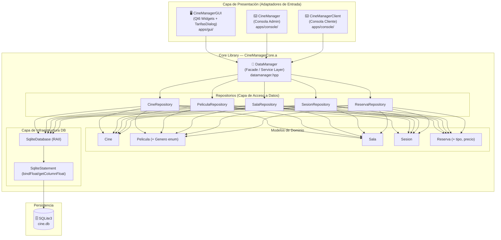

# CineManager — Documentación Técnica de Desarrollo

> **Versión del documento:** 2.0 · **Fecha:** Agosto 2026  
> **Proyecto:** CineManager v2.0 · **Lenguaje:** C++17/20 · **Build:** CMake + Ninja / GCC / Clang

---

## Tabla de Contenidos

1. [Visión General de la Arquitectura](#1-visión-general-de-la-arquitectura)
2. [Capa de Dominio — Core Library](#2-capa-de-dominio--core-library)
3. [Capa de Persistencia — Repositorios y SQLite](#3-capa-de-persistencia--repositorios-y-sqlite)
4. [Fachada de Datos — DataManager](#4-fachada-de-datos--datamanager)
5. [Sistema de Concurrencia y Expiración de Reservas](#5-sistema-de-concurrencia-y-expiración-de-reservas)
6. [Capa de Presentación — Interfaz Gráfica (Qt6)](#6-capa-de-presentación--interfaz-gráfica-qt6)
7. [Capa de Presentación — Interfaz de Consola](#7-capa-de-presentación--interfaz-de-consola)
8. [Guía de Setup y Compilación](#8-guía-de-setup-y-compilación)
9. [Deuda Técnica Identificada y Resuelta](#9-deuda-técnica-identificada-y-resuelta)

---

## 1. Visión General de la Arquitectura

CineManager implementa un patrón de **Arquitectura Hexagonal** (también llamada *Ports & Adapters*), donde el núcleo de la aplicación (`CineManagerCore`) está completamente desacoplado de sus adaptadores de entrada. Esta separación se materializa a nivel de compilación en una **librería estática independiente** (`CineManagerCore.a`).

### 1.1 Diagrama de Capas



### 1.2 Estructura de Directorios

```
CineManager/
├── CMakeLists.txt          # Build system unificado (file GLOB_RECURSE para GUI)
├── build.sh                # Script de automatización (ASan/Valgrind)
├── core/                   # ← Librería estática CineManagerCore
│   ├── include/
│   │   ├── db/
│   │   │   ├── database.hpp          # SqliteDatabase + SqliteStatement (bindFloat, getColumnFloat)
│   │   │   ├── datamanager.hpp       # Facade principal (API pública del core)
│   │   │   └── repositories/
│   │   │       ├── cinerepository.hpp
│   │   │       ├── pelicularepository.hpp
│   │   │       ├── salarepository.hpp
│   │   │       ├── sesionrepository.hpp
│   │   │       └── reservarepository.hpp (Sincronizado con tipo y precio)
│   │   └── models/
│   │       ├── asiento.hpp
│   │       ├── cine.hpp
│   │       ├── pelicula.hpp  # Incluye enum Genero
│   │       ├── sala.hpp
│   │       ├── sesion.hpp    # Contiene Pelicula embebida (composición)
│   │       └── reserva.hpp   # Atributos: id, idSesion, fila, columna, estado, timestampCreacion, tipo, precio
│   └── src/                  # Implementaciones espejo de include/
├── apps/
│   ├── console/              # Adaptadores CLI
│   │   ├── app/main_admin.cpp
│   │   ├── app/main_client.cpp
│   │   ├── include/          # Controladores de consola
│   │   └── src/
│   └── gui/                  # Adaptador Qt6 Widgets
│       ├── app/main_gui.cpp  # Búsqueda robusta multi-fallback de style.qss
│       ├── include/
│       │   ├── mainwindow.h
│       │   ├── cinecardwidget.h
│       │   ├── moviecardwidget.h
│       │   └── tarifasdialog.h # Diálogo modal para selección de tarifas por butaca
│       ├── src/
│       │   ├── mainwindow.cpp
│       │   ├── cinecardwidget.cpp
│       │   ├── moviecardwidget.cpp
│       │   └── tarifasdialog.cpp
│       └── ui/
│           ├── mainwindow.ui
│           ├── tarifasdialog.ui # UI modal en tema oscuro
│           └── style.qss
└── data/
    ├── db_init.sql           # Esquema relacional con CHECK de tarifas ('Adulto', 'Niño', 'Jubilado', 'Estudiante')
    ├── cine.db               # Base de datos SQLite
    └── images/               # Assets de imagen para la GUI
```

---

## 2. Capa de Dominio — Core Library

### 2.1 Modelos de Entidad

Los modelos son clases C++ puras (*Plain Old Data* con encapsulación), sin dependencia de frameworks gráficos.

| Entidad | Atributos clave | Relaciones |
|---------|----------------|------------|
| `Cine` | `id`, `nombre`, `direccion` | Tiene `Sala`s |
| `Sala` | `id`, `cineId`, `numeroSala`, `filas`, `columnas` | Pertenece a `Cine` |
| `Pelicula` | `id`, `titulo`, `Genero` (enum), `duracion` | Proyectada en `Sesion` |
| `Sesion` | `id`, `Pelicula` (composición), `idSala`, `horaInicio` (`time_t`), `precioEntrada` | Une `Pelicula` + `Sala` |
| `Reserva` | `id`, `idSesion`, `fila`, `columna`, `estado`, `timestampCreacion`, `tipo`, `precio` | Pertenece a `Sesion` |

---

## 3. Capa de Persistencia — Repositorios y SQLite

### 3.1 Esquema de la Tabla `reservas`

```sql
CREATE TABLE reservas (
    id INTEGER PRIMARY KEY AUTOINCREMENT,
    sesion_id INTEGER NOT NULL,
    fila INTEGER NOT NULL,
    columna INTEGER NOT NULL,
    estado TEXT NOT NULL DEFAULT 'PENDIENTE',
    timestamp_creacion INTEGER NOT NULL DEFAULT 0,
    tipo TEXT CHECK (tipo IN ('Adulto', 'Niño', 'Jubilado', 'Estudiante')),
    precio REAL NOT NULL DEFAULT 7.50,
    FOREIGN KEY (sesion_id) REFERENCES sesiones(id) ON DELETE CASCADE,
    UNIQUE(sesion_id, fila, columna)
);
```

---

## 6. Capa de Presentación — Interfaz Gráfica (Qt6)

### 6.6 Ventana Emergente de Tarifas (`TarifasDialog`)

El diálogo emergente modal `TarifasDialog` intercepta el botón **"Confirmar Compra"** en la sala:
- Recibe las coordenadas de las butacas seleccionadas en el mapa (`std::set<std::pair<int, int>>`).
- Genera dinámicamente un desplegable `QComboBox` por cada butaca permitiendo elegir entre:
  - `Adulto` (7.50 €) — Opción por defecto
  - `Niño` (5.00 €)
  - `Jubilado` (5.50 €)
  - `Estudiante` (5.50 €)
- Recalcula el precio total acumulado en tiempo real al conmutar cualquier desplegable.
- Devuelve un `std::vector<TarifaAsiento>` que `MainWindow` guarda en SQLite.

---

## 9. Deuda Técnica Identificada y Resuelta

| # | Componente | Descripción | Estado |
|---|-----------|-------------|--------|
| DT-01 | `database.cpp` | Heurístico frágil de resolución de ruta de `cine.db` | 🟡 Pendiente |
| DT-02 | `database.cpp` | No se activa `PRAGMA foreign_keys = ON` | 🔴 Pendiente |
| DT-03 | `database.cpp` | No se activa `PRAGMA journal_mode = WAL` | 🟡 Pendiente |
| **DT-04** | `mainwindow.cpp` | **Precio hardcodeado a 7.50€** | ✅ **RESUELTO** (Implementado `TarifasDialog` + campo `precio` en BD) |
| **DT-05** | `main_gui.cpp` | **Ruta `style.qss` relativa al CWD frágil** | ✅ **RESUELTO** (Búsqueda multi-fallback añadida) |
| DT-06 | `sesionrepository.cpp` | N+1 queries en `obtenerSesionesDePelicula` | 🟢 Pendiente |
| DT-07 | `cinecardwidget.cpp` | Rating "⭐ 4.5 • Premium" estático | 🟢 Pendiente |
| DT-08 | `mainwindow.cpp` | QR generado desde imagen estática `qr_mock.jpg` | 🟢 Pendiente (Siguiente hito) |
| DT-09 | General | Ausencia de suite de tests automatizados | 🔴 Pendiente |
