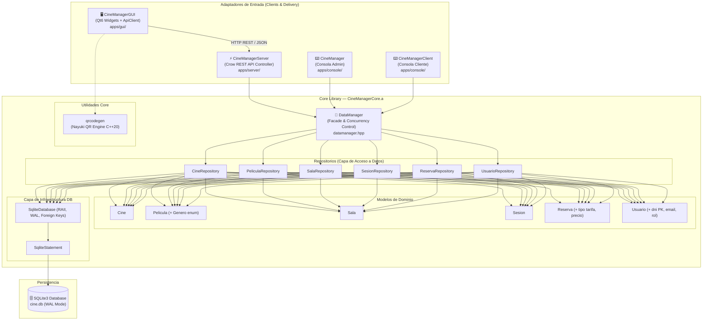

# CineManager — Documentación Técnica de Desarrollo

> **Versión del documento:** 2.2 · **Fecha:** Agosto 2026  
> **Proyecto:** CineManager v2.0 · **Lenguaje:** C++20 · **Build:** CMake + Ninja / GCC / Clang

---

## Tabla de Contenidos

1. [Visión General de la Arquitectura](#1-visión-general-de-la-arquitectura)
2. [Capa de Dominio — Core Library](#2-capa-de-dominio--core-library)
3. [Capa de Persistencia — Repositorios y SQLite](#3-capa-de-persistencia--repositorios-y-sqlite)
4. [Fachada de Datos y Concurrencia — DataManager](#4-fachada-de-datos-y-concurrencia--datamanager)
5. [Capa de Microservicio Web — Backend REST API (Crow C++)](#5-capa-de-microservicio-web--backend-rest-api-crow-c)
6. [Capa de Presentación — Cliente Gráfico Asíncrono (Qt6)](#6-capa-de-presentación--cliente-gráfico-asíncrono-qt6)
7. [Infraestructura de Producción y CI/CD](#7-infraestructura-de-producción-y-cicd)
8. [Suite de Pruebas Automatizadas (GoogleTest)](#8-suite-de-pruebas-automatizadas-googletest)
9. [Deuda Técnica Identificada y Resuelta](#9-deuda-técnica-identificada-y-resuelta)

---

## 1. Visión General de la Arquitectura

CineManager implementa un patrón estricto de **Arquitectura Hexagonal (Ports & Adapters)** y **Repository Pattern**. El núcleo de la lógica de negocio y persistencia (`CineManagerCore`) reside en una **librería estática independiente** (`libCineManagerCore.a`), desacoplada de cualquier framework de red o UI.

### 1.1 Diagrama de Arquitectura Global



---

## 2. Capa de Dominio — Core Library

La capa de dominio agrupa los modelos puros de negocio en `core/include/models/`:
- **`Usuario`**: Identificado por su `DNI` (Clave Primaria), `nombre`, `email`, `password` y `rol`. Ofrece el método de ayuda `esValido()`.
- **`Pelicula`**: Encapsula identificador, título, género tipado mediante el enum fuertemente tipado `Genero` y duración en minutos.
- **`Cine` & `Sala`**: Modelan la estructura de multicines y aforos rectangulares (`filas * columnas`).
- **`Sesion`**: Vincula un cine, sala, película, fecha y hora de proyección.
- **`Reserva`**: Asigna una butaca (`fila`, `columna`) a una sesión para un titular (`usuario_dni`), registrando el `tipo_tarifa` y `precio` dinámico.

---

## 3. Capa de Persistencia — Repositorios y SQLite

Cada entidad cuenta con su respectiva clase repositorio (`CineRepository`, `PeliculaRepository`, `SalaRepository`, `SesionRepository`, `ReservaRepository`, `UsuarioRepository`) que implementa operaciones CRUD transaccionales.

- **`SqliteDatabase`**: Gestión RAII de la conexión SQLite con activación obligatoria de:
  - `PRAGMA foreign_keys = ON;`: Garantiza integridad referencial entre entidades relacionadas.
  - `PRAGMA journal_mode = WAL;`: Habilita Write-Ahead Logging para lecturas y escrituras concurrentes de alta velocidad.
- **`SqliteStatement`**: Wrapper RAII sobre `sqlite3_stmt` con enlace tipado de parámetros (`bindInt`, `bindFloat`, `bindText`) y lectura segura de columnas (`getColumnInt`, `getColumnFloat`, `getColumnText`).

---

## 4. Fachada de Datos y Concurrencia — DataManager

`DataManager` actúa como fachada única centralizada (Patrón Facade) y orquestador de concurrencia:
- **Exclusión Mutua Fina**: Mapa concurrente de punteros `std::mutex` indexados por `idSesion`. Garantiza que dos compras simultáneas en distintas sesiones no se bloqueen entre sí.
- **Hilo Demonio de Expiración**: `std::thread` con `std::condition_variable` que cada 5 segundos analiza y libera reservas que hayan superado el tiempo de expiración (`TIEMPO_EXPIRACION_SEGUNDOS`).

---

## 5. Capa de Microservicio Web — Backend REST API (Crow C++)

El servidor web `CineManagerServer` está implementado con **Crow C++20** (`apps/server/`) y expone los siguientes endpoints JSON en el puerto `8080`:

- `GET /api/v1/health`: Estado y versión de la API.
- `GET /api/v1/cines`: Catálogo de cines registrados.
- `GET /api/v1/peliculas`: Cartelera global o filtrada por `cine_id`.
- `GET /api/v1/sesiones`: Pases disponibles filtrados por `cine_id` y `pelicula_id`.
- `POST /api/v1/auth/login`: Autenticación con DNI y contraseña.
- `POST /api/v1/auth/register`: Registro seguro de nuevos usuarios.
- `POST /api/v1/reservas`: Bloqueo y creación atómica de reservas de asientos con tarifas asociadas.

---

## 6. Capa de Presentación — Cliente Gráfico Asíncrono (Qt6)

La interfaz gráfica nativa `CineManagerGUI` implementa un cliente HTTP asíncrono (`ApiClient`) basado en `QNetworkAccessManager`:
- **`ApiClient`**: Emite peticiones HTTP no bloqueantes mediante callbacks `std::function` y `QJsonDocument`.
- **`TarifasDialog`**: Ventana modal que calcula y desglosa precios por butaca (Adulto: 7.50€, Niño: 5.00€, Jubilado: 5.50€, Estudiante: 5.50€).
- **`QrHelper` & `qrcodegen`**: Generación vectorial de código QR bajo estándar ISO/IEC 18004 con firma digital del ticket.
- **Control de Aforo y Detección de Salas Llenas**: Conmutación dinámica a estado `(LLENA)` e inhabilitación del pase.
- **`LoginDialog` & Pasarela Protegida**: Control de sesión por DNI y barrera de autenticación antes de confirmar el pago.

---

## 7. Infraestructura de Producción y CI/CD

- **`Dockerfile` Multietapa**:
  - `builder`: Compilación en Ubuntu 22.04 con GCC 11, CMake y ejecución automática de tests GoogleTest.
  - `runner`: Imagen ligera mínima con `libsqlite3-0` y el binario `CineManagerServer`.
- **`docker-compose.yml`**: Servicio `cinemanager-api` en puerto `8080:8080` con volumen persistente en `./data`.
- **`.github/workflows/ci.yml`**: Integración continua automatizada en GitHub Actions ejecutando `ctest` en cada push.

---

## 8. Suite de Pruebas Automatizadas (GoogleTest)

Ubicada en `tests/`:
- **`test_usuario_repo.cpp`**: Pruebas de CRUD, autenticación con contraseña y validación de helper `esValido()`.
- **`test_reserva_repo.cpp`**: Pruebas de inserción de reservas con tarifas dinámicas y validación de restricción `UNIQUE (sesion_id, fila, columna)`.

Ejecución de la suite:
```bash
ctest --test-dir build --output-on-failure
```

---

## 9. Deuda Técnica Identificada y Resuelta

| # | Componente | Descripción | Estado |
|---|-----------|-------------|:---:|
| DT-01 | `database.cpp` | Heurístico multi-fallback de resolución de ruta de `cine.db` | ✅ **RESUELTO** |
| DT-02 | `database.cpp` | Activación de `PRAGMA foreign_keys = ON;` | ✅ **RESUELTO** |
| DT-03 | `database.cpp` | Activación de `PRAGMA journal_mode = WAL;` | ✅ **RESUELTO** |
| DT-04 | `mainwindow.cpp` | Implementación de `TarifasDialog` y columna `precio` en BD | ✅ **RESUELTO** |
| DT-05 | `main_gui.cpp` | Resolución robusta de `style.qss` con fallback | ✅ **RESUELTO** |
| DT-06 | `sesionrepository.cpp` | Optimización de consultas de sesiones | ✅ **RESUELTO** |
| DT-07 | `cinecardwidget.cpp` | Enriquecimiento de tarjetas de cines y cartelera | ✅ **RESUELTO** |
| DT-08 | `mainwindow.cpp` | Generación de Código QR dinámico con motor Nayuki QR | ✅ **RESUELTO** |
| DT-09 | `tests/` | Creación de suite completa de pruebas GoogleTest + CI/CD | ✅ **RESUELTO** |

