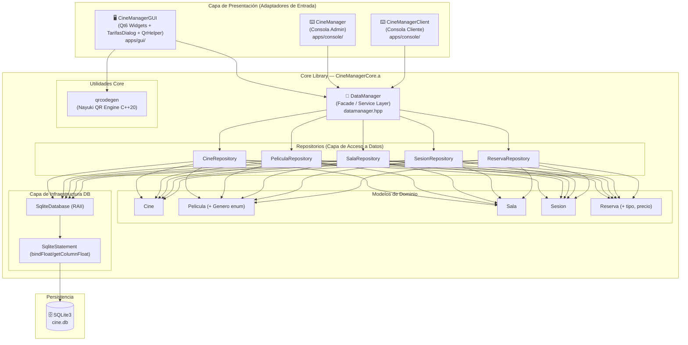

# CineManager — Documentación Técnica de Desarrollo

> **Versión del documento:** 2.1 · **Fecha:** Agosto 2026  
> **Proyecto:** CineManager v2.0 · **Lenguaje:** C++17/20 · **Build:** CMake + Ninja / GCC / Clang

---

## Tabla de Contenidos

1. [Visión General de la Arquitectura](#1-visión-general-de-la-arquitectura)
2. [Capa de Dominio — Core Library](#2-capa-de-dominio--core-library)
3. [Capa de Persistencia — Repositorios y SQLite](#3-capa-de-persistencia--repositorios-y-sqlite)
4. [Fachada de Datos — DataManager](#4-fachada-de-datos--datamanager)
5. [Sistema de Concurrencia y Expiración de Reservas](#5-sistema-de-concurrencia-y-expiración-de-reservas)
6. [Capa de Presentación — Interfaz Gráfica (Qt6)](#6-capa-de-presentación--interfaz-gráfica-qt6)
7. [Capa de Presentación — Interfaz de Consola](#7-capa-de-presentación--interfaz-de-consola)
8. [Guía de Setup y Compilación](#8-guía-de-setup-y-compilación)
9. [Deuda Técnica Identificada y Resuelta](#9-deuda-técnica-identificada-y-resuelta)

---

## 1. Visión General de la Arquitectura

CineManager implementa un patrón de **Arquitectura Hexagonal** (también llamada *Ports & Adapters*), donde el núcleo de la aplicación (`CineManagerCore`) está completamente desacoplado de sus adaptadores de entrada. Esta separación se materializa a nivel de compilación en una **librería estática independiente** (`CineManagerCore.a`).

### 1.1 Diagrama de Capas

---

## 6. Capa de Presentación — Interfaz Gráfica (Qt6)

### 6.6 Ventana Emergente de Tarifas (`TarifasDialog`)

El diálogo emergente modal `TarifasDialog` intercepta el botón **"Confirmar Compra"** en la sala:
- Recibe las coordenadas de las butacas seleccionadas en el mapa (`std::set<std::pair<int, int>>`).
- Genera dinámicamente un desplegable `QComboBox` por cada butaca permitiendo elegir entre:
  - `Adulto` (7.50 €) — Opción por defecto
  - `Niño` (5.00 €)
  - `Jubilado` (5.50 €)
  - `Estudiante` (5.50 €)
- Recalcula el precio total acumulado en tiempo real al conmutar cualquier desplegable.

### 6.7 Generación de Código QR Real (`qrcodegen` & `QrHelper`)

- **Motor Core:** Implementación en C++20 de la librería oficial Nayuki QR Code Generator en `core/include/utils/qrcodegen.hpp` y `core/src/utils/qrcodegen.cpp`.
- **Adaptador Qt:** `QrHelper::generarQR(const QString& texto, int tamanoDeseado)`:
  - Genera la matriz QR utilizando corrección de errores Reed-Solomon (Nivel Medium).
  - Añade un margen de *Quiet Zone* de 4 módulos respetando ISO/IEC 18004.
  - Renderiza mediante `Qt::FastTransformation` (vecino más cercano) para garantizar bordes 100% nítidos sin anti-aliasing borroso.
- **Firma digital del Ticket:** Codifica Película, Cine, Sala, Fecha/Hora, Asientos con sus respectivas tarifas en paréntesis y Precio Total.

### 6.8 Detección y Bloqueo de Salas Llenas (`(LLENA)`)

- Al seleccionar una película, `MainWindow` consulta en SQLite la capacidad de la sala (`filas * columnas`) y las reservas de la sesión.
- Si una sesión alcanza el 100% de ocupación, su botón de selección se deshabilita inmediatamente (`setEnabled(false)`), cambia su etiqueta a `18:30 \n (LLENA)` y adopta un tema visual rojo/gris de advertencia (`#e06c75`).

---

## 9. Deuda Técnica Identificada y Resuelta

| # | Componente | Descripción | Estado |
|---|-----------|-------------|--------|
| DT-01 | `database.cpp` | Heurístico frágil de resolución de ruta de `cine.db` | 🟡 Pendiente |
| DT-02 | `database.cpp` | No se activa `PRAGMA foreign_keys = ON` | 🔴 Pendiente |
| DT-03 | `database.cpp` | No se activa `PRAGMA journal_mode = WAL` | 🟡 Pendiente |
| **DT-04** | `mainwindow.cpp` | **Precio hardcodeado a 7.50€** | ✅ **RESUELTO** (Implementado `TarifasDialog` + campo `precio` en BD) |
| **DT-05** | `main_gui.cpp` | **Ruta `style.qss` relativa al CWD frágil** | ✅ **RESUELTO** (Búsqueda multi-fallback añadida) |
| DT-06 | `sesionrepository.cpp` | N+1 queries en `obtenerSesionesDePelicula` | 🟢 Pendiente |
| DT-07 | `cinecardwidget.cpp` | Rating "⭐ 4.5 • Premium" estático | 🟢 Pendiente |
| **DT-08** | `mainwindow.cpp` | **QR generado desde imagen estática `qr_mock.jpg`** | ✅ **RESUELTO** (Integrado motor QR Nayuki + `QrHelper`) |
| DT-09 | General | Ausencia de suite de tests automatizados | 🔴 Pendiente |
