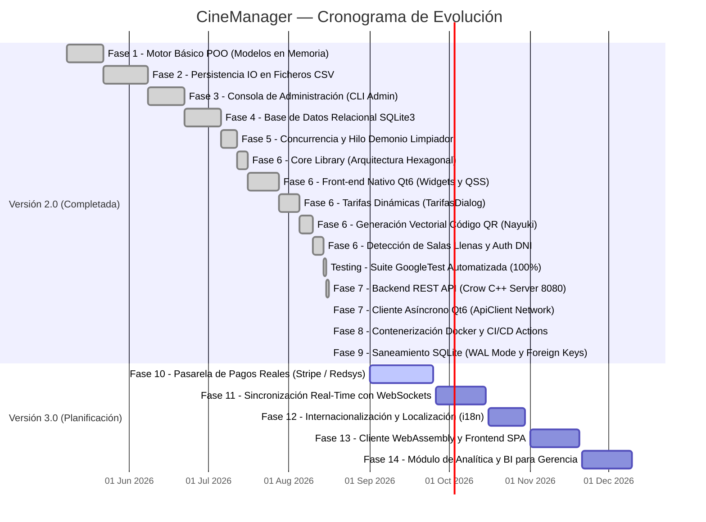

# CineManager — Roadmap de Desarrollo y Visión v3.0

> **Versión del documento:** 2.2 · **Fecha de Actualización:** Agosto 2026  
> **Estado del Proyecto:** ✅ **CineManager v2.0 Producción (100% Completado)**  

---

## 📅 Timeline de Desarrollo — Hitos Completados (v2.0)

---

## 🔍 Checklist de Características — Versión 2.0 (Cierre Formal)

### 🎟️ Flujo de Taquilla y Experiencia de Usuario (GUI Qt6)
- [x] **Exploración de Complejos**: Selección visual interactiva de cines mediante `CineCardWidget`.
- [x] **Cartelera Dinámica**: Búsqueda textual y filtrado en vivo por género (`ACCION`, `DRAMA`, `COMEDIA`, `CIENCIA_FICCION`, `TERROR`).
- [x] **Gestión de Horarios y Aforo**: Agrupación cronológica de sesiones con detección y bloqueo de salas llenas `(LLENA)`.
- [x] **Mapa de Butacas**: Matriz gráfica de asientos con selección múltiple mediante `std::set<std::pair<int, int>>`.
- [x] **Tarifas Dinámicas**: Diálogo modal `TarifasDialog` con desglose personalizado por butaca (Adulto, Niño, Jubilado, Estudiante).
- [x] **Ticket Digital con QR**: Renderizado HTML con código QR generado algorítmicamente bajo norma ISO/IEC 18004 (*Nayuki QR engine*).
- [x] **Pasarela de Seguridad (*Checkout Gatekeeper*)**: Autenticación por DNI, registro guiado y soporte para compra en modo invitado.

### ⚙️ Núcleo Transaccional, Concurrencia y Persistencia
- [x] **Arquitectura Hexagonal**: Aislamiento estricto de `libCineManagerCore.a` de cualquier dependencia de red o interfaz gráfica.
- [x] **Exclusión Mutua de Grano Fino**: Mapa concurrente de punteros `std::mutex` por ID de sesión para eliminar bloqueos innecesarios entre compras de distintas salas.
- [x] **Hilo Demonio de Expiración**: `std::jthread` supervisor con condición de espera que libera reservas `PENDIENTES` tras 5 minutos de inactividad.
- [x] **Persistencia Relacional Segura**: SQLite3 con `PRAGMA foreign_keys = ON;` y `PRAGMA journal_mode = WAL;`.
- [x] **Transacciones ACID**: Bloqueo atómico de lotes de reservas (`crearReservasMultiples`) con soporte para rollback automático ante fallos de concurrencia.

### 🌐 Microservicio Web REST API y Conectividad
- [x] **Servidor Crow C++20**: Microservicio asíncrono en puerto `8080` (`CineManagerServer`).
- [x] **Catálogo de Endpoints JSON**: Rutas para salud (`/health`), cines (`/cines`), cartelera (`/peliculas`), sesiones enriquecidas (`/sesiones`), autenticación (`/auth/login`, `/auth/register`) y reservas (`/reservas`).
- [x] **Cliente Gráfico Asíncrono**: `ApiClient` (`QNetworkAccessManager`) totalmente desacoplado de la interfaz principal.
- [x] **Especificación OpenAPI 3.0**: Archivo formal `docs/openapi.yaml` para integración con herramientas externas.

### 🧪 Calidad, Infraestructura y DevOps
- [x] **Suite GoogleTest**: Cobertura completa de modelos, repositorios, claves únicas y pruebas de estrés concurrente con múltiples hilos.
- [x] **Contenerización Docker**: `Dockerfile` multietapa optimizado para producción.
- [x] **Orquestación**: `docker-compose.yml` con volúmenes persistentes y chequeos de salud.
- [x] **Pipeline CI/CD**: Integración continua automatizada con GitHub Actions (`.github/workflows/ci.yml`).

---

## 🔮 Visión Estratégica — CineManager v3.0

Para la versión 3.0, el proyecto evolucionará de una aplicación de taquilla monolítica/cliente-servidor a una plataforma de entretenimiento omnicanal en la nube:

### 💳 1. Pasarela de Pagos Reales (Stripe & Redsys)
- Integración de webhooks y SDK C++ de Stripe para procesar cobros reales con tarjeta de crédito/débito y Apple Pay / Google Pay.
- Generación de facturas electrónicas con firma digital en formato PDF exportable.

### 🔄 2. Sincronización en Tiempo Real con WebSockets
- Implementación de canal bidireccional WebSocket en Crow C++ (`/ws/sala/{idSesion}`).
- Actualización en tiempo real de la matriz de butacas: cuando un usuario selecciona un asiento en una terminal, se refleja inmediatamente como *bloqueado* en las pantallas de los demás usuarios sin necesidad de refrescar.

### 🌍 3. Internacionalización y Localización Completa (i18n)
- Soporte multi-idioma mediante `Qt Linguist` (`.ts` / `.qm`) para Español, Inglés, Francés y Alemán.
- Adaptación automática de formatos de moneda (€ / $ / £) y fechas según la configuración regional del sistema operativo.

### 🌐 4. Cliente Web WebAssembly & SPA Moderna
- Compilación de la interfaz gráfica a WebAssembly (`Qt for WebAssembly`) para ejecución directa en cualquier navegador web sin instalación.
- Desarrollo complementario de un frontend SPA en React / TypeScript que consuma la API REST existente.

### 📊 5. Panel de Business Intelligence (BI) para Gerencia
- Módulo de métricas en tiempo real: tasa de ocupación por sala, recaudación por franja horaria y géneros más taquilleros.
- Exportación automatizada de reportes contables a Excel y CSV.

---

## 📋 Resumen del Backlog Técnico Resuelto (v2.0)

| ID | Módulo | Descripción | Severidad | Estado |
| :---: | :--- | :--- | :---: | :---: |
| **DT-01** | `database.cpp` | Algoritmo heurístico multi-fallback para resolución de ruta de `cine.db`. | 🟡 Media | ✅ **RESUELTO** |
| **DT-02** | `database.cpp` | Activación de integridad referencial estricta `PRAGMA foreign_keys = ON;`. | 🔴 Alta | ✅ **RESUELTO** |
| **DT-03** | `database.cpp` | Activación de Write-Ahead Logging con `PRAGMA journal_mode = WAL;`. | 🟡 Media | ✅ **RESUELTO** |
| **DT-04** | `mainwindow.cpp` | Tarifas dinámicas con `TarifasDialog` y columna `precio` en la BD. | 🟡 Media | ✅ **RESUELTO** |
| **DT-05** | `main_gui.cpp` | Carga resiliente de hojas de estilo `style.qss`. | 🟡 Media | ✅ **RESUELTO** |
| **DT-06** | `sesionrepository.cpp` | Consultas optimizadas para evitar problemas de consultas $N+1$. | 🟡 Media | ✅ **RESUELTO** |
| **DT-07** | `cinecardwidget.cpp` | Tarjetas dinámicas enriquecidas con filtrado en vivo. | 🟡 Media | ✅ **RESUELTO** |
| **DT-08** | `qrhelper.cpp` | Generación real de códigos QR bajo norma ISO/IEC 18004 con Nayuki C++20. | 🟢 Baja | ✅ **RESUELTO** |
| **DT-09** | `tests/` | Suite automatizada GoogleTest y pipeline de CI en GitHub Actions. | 🔴 Alta | ✅ **RESUELTO** |
| **DT-10** | `datamanager.cpp` | Prevención de condiciones TOCTOU en `eliminarReserva()` y transacciones atómicas. | 🟡 Media | ✅ **RESUELTO** |

---

  CineManager v2.0 · Roadmap Oficial y Planificación de Versiones · 2026

