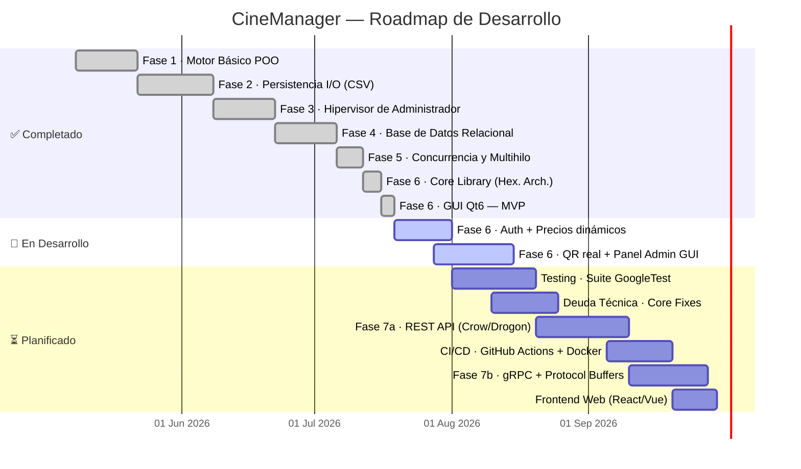

# CineManager — Roadmap Visual de Desarrollo

> **Versión:** 1.0 · **Fecha:** Julio 2026 · **Revisado con:** 64 commits · ~4,000 LOC

---

## 📅 Timeline General — Fases del Proyecto




---

## 🔍 Estado Actual Detallado — Fase 6 (GUI Qt6)

### Flujo de Compra — Pantallas Implementadas

| # | Pantalla | Componente | Estado | Pendiente |
|---|----------|-----------|--------|-----------|
| 0 | Selección de Cine | `CineCardWidget` + `QListWidget` | ✅ Funcional | Rating dinámico desde DB |
| 1 | Cartelera de Películas | `MovieCardWidget` + búsqueda/filtro | ✅ Funcional | — |
| 2 | Selección de Sesión | Agrupación por días + botones horarios | ✅ Funcional | Precio dinámico visible por sesión |
| 3 | Mapa de Sala (Butacas) | `QGridLayout` dinámico + multi-selección | ✅ Funcional | — |
| 4 | Ticket de Compra | HTML rico + QR mock | ✅ Funcional | QR real generado dinámicamente |

### Funcionalidades de la GUI — Checklist de Estado

#### 🎟️ Flujo Cliente (Taquilla)
- [x] Visualización de cines disponibles
- [x] Cartelera de películas por cine
- [x] Búsqueda de películas por texto
- [x] Filtrado de películas por género
- [x] Vista de sesiones agrupadas por día
- [x] Mapa visual de sala con butacas
- [x] Selección múltiple de asientos
- [x] Cálculo de precio total (hardcodeado 7.50€)
- [x] Confirmación de compra con ticket HTML
- [ ] 🔴 **Precio dinámico real** (campo `precio_entrada` en DB ignorado)
- [ ] 🔴 **Autenticación de usuario** (login/registro antes de la compra)
- [ ] 🔴 **Generación real de QR** (actualmente imagen estática)
- [ ] 🟡 Animaciones de transición entre páginas del `QStackedWidget`
- [ ] 🟡 Historial de reservas del usuario autenticado

#### 🛡️ Panel de Administración (No existe en GUI)
- [x] ✅ Disponible en consola (`CineManager`)
- [ ] 🔴 **CRUD de Cines** en interfaz gráfica
- [ ] 🔴 **CRUD de Películas** en interfaz gráfica
- [ ] 🔴 **CRUD de Salas** en interfaz gráfica
- [ ] 🔴 **CRUD de Sesiones** en interfaz gráfica
- [ ] 🔴 Dashboard con estadísticas de ocupación

---

## 🧪 Testing — Plan de Adopción GoogleTest

> **Decisión:** Integrar **GoogleTest (gtest/gmock)** como framework principal.

### Hoja de Ruta de Testing

| Prioridad | Módulo | Tipo de Test | Tests a Implementar |
|-----------|--------|-------------|-------------------|
| 🔴 Alta | `DataManager` | Integración | Reserva concurrente (race condition), expiración de pendientes, doble reserva misma butaca |
| 🔴 Alta | `ReservaRepository` | Unitario | CRUD completo, `obtenerPendientes()`, estados de reserva |
| 🔴 Alta | `SesionRepository` | Unitario | Filtrado por fecha, JOINs con sala/cine, sesiones futuras |
| 🟡 Media | `CineRepository` | Unitario | CRUD básico, manejo de IDs inválidos |
| 🟡 Media | `PeliculaRepository` | Unitario | `obtenerCartelera()`, conversión de `Genero` |
| 🟡 Media | `SalaRepository` | Unitario | CRUD, `obtenerSalasDeCine()` |
| 🟢 Baja | Modelos de dominio | Unitario | Constructores, getters, `Genero` enum helpers |

### Integración en CMake (propuesta)

```cmake
# En CMakeLists.txt — a añadir en Fase de Testing
include(FetchContent)
FetchContent_Declare(googletest
  URL https://github.com/google/googletest/archive/v1.14.0.zip)
FetchContent_MakeAvailable(googletest)

add_executable(CineManagerTests tests/...)
target_link_libraries(CineManagerTests CineManagerCore GTest::gtest_main)
enable_testing()
add_test(NAME CineManagerTests COMMAND CineManagerTests)
```

### Configuración de Test DB

Los tests de integración requerirán una base de datos SQLite in-memory o de fixtures:

```cpp
// Ejemplo: Test de doble reserva con DB in-memory
TEST(DataManagerTest, DobleReservaMismaButacaRetornaError) {
    // Usar :memory: como ruta de DB para tests aislados
    DataManager dm(":memory:");
    // ... setup fixtures ...
    int id1 = dm.crearReserva(Reserva(-1, 1, 3, 5, "COMPRADO"));
    int id2 = dm.crearReserva(Reserva(-1, 1, 3, 5, "COMPRADO")); // misma F3,C5
    EXPECT_NE(id1, -1);
    EXPECT_EQ(id2, -1); // Debe rechazarse
}
```

---

## 🗺️ Roadmap Completo por Hitos

### 🏁 Hito 1 — Completar Fase 6: GUI Funcional Completa
**Estimación:** Agosto–Noviembre 2026

```
Estado actual: ████████████░░░░░░░░ 60%
```

| Tarea | Prioridad | Estimación | Estado |
|-------|-----------|-----------|--------|
| Sistema de login/registro con roles | 🔴 Crítico | 2 semanas | ⏳ Pendiente |
| Precios dinámicos desde `sesion.precio_entrada` | 🔴 Crítico | 2 días | ⏳ Pendiente |
| Generación de QR real (libqrencode o Qt QR) | 🔴 Crítico | 1 semana | ⏳ Pendiente |
| Panel de Administración GUI | 🟡 Importante | 3 semanas | ⏳ Pendiente |
| Animaciones de transición `QPropertyAnimation` | 🟢 Nice-to-have | 1 semana | ⏳ Pendiente |
| Historial de reservas del usuario | 🟢 Nice-to-have | 1 semana | ⏳ Pendiente |
| Fix: ruta `style.qss` frágil → QRC resource | 🟡 Importante | 1 día | ⏳ Pendiente |

### 🏁 Hito 2 — Suite de Testing GoogleTest
**Estimación:** Agosto–Octubre 2026 (paralelo a Hito 1)

| Tarea | Estado |
|-------|--------|
| Integrar gtest en CMakeLists.txt con FetchContent | ⏳ Pendiente |
| Adaptar `SqliteDatabase` para soportar ruta configurable (`:memory:`) | ⏳ Pendiente |
| Tests unitarios de repositorios (CRUD + edge cases) | ⏳ Pendiente |
| Tests de integración de `DataManager` (concurrencia, expiración) | ⏳ Pendiente |
| Target `make test` o `ctest` en el flujo de build | ⏳ Pendiente |

### 🏁 Hito 3 — Corrección de Deuda Técnica Core
**Estimación:** Septiembre–Octubre 2026

| Tarea | DT Ref | Estado |
|-------|--------|--------|
| Activar `PRAGMA foreign_keys = ON` en `abrirSQL()` | DT-02 | ⏳ Pendiente |
| Activar `PRAGMA journal_mode = WAL` para escrituras concurrentes | DT-03 | ⏳ Pendiente |
| Eliminar heurístico de ruta DB → argumento de CLI o variable de entorno | DT-01 | ⏳ Pendiente |
| Resolver N+1 en `obtenerSesionesDePelicula` con JOIN en una sola query | DT-06 | ⏳ Pendiente |
| Revisar TOCTOU en `eliminarReserva()` (leer-luego-eliminar) | DT-10 | ⏳ Pendiente |

### 🏁 Hito 4 — Fase 7a: REST API
**Estimación:** Noviembre 2026 – Febrero 2027

> **Stack candidato:** [Crow](https://crowcpp.org/) o [Drogon](https://github.com/drogonframework/drogon)

| Tarea | Estado |
|-------|--------|
| Diseño de endpoints REST (OpenAPI spec) | ⏳ Pendiente |
| Implementar servidor HTTP sobre `CineManagerCore` | ⏳ Pendiente |
| Serialización JSON (nlohmann/json o rapidjson) | ⏳ Pendiente |
| Autenticación JWT para API | ⏳ Pendiente |
| Tests de integración de API (Postman/Newman o gtest HTTP) | ⏳ Pendiente |

**Endpoints propuestos (draft):**
```
GET  /api/cines                          → Lista de cines
GET  /api/cines/{id}/cartelera           → Películas en cartelera
GET  /api/peliculas/{id}/sesiones        → Sesiones futuras
POST /api/reservas                        → Crear reserva
DELETE /api/reservas/{id}               → Cancelar reserva
GET  /api/sesiones/{id}/disponibilidad  → Mapa de butacas
```

### 🏁 Hito 5 — Fase 7b: gRPC + Protocol Buffers
**Estimación:** Febrero–Junio 2027

> El Core se convierte en un **servidor gRPC independiente**. Las interfaces (GUI, web) pasan a ser clientes gRPC.

| Tarea | Estado |
|-------|--------|
| Definir `.proto` para todos los mensajes del dominio | ⏳ Pendiente |
| Implementar servidor gRPC sobre `CineManagerCore` | ⏳ Pendiente |
| Adaptar GUI Qt6 para comunicarse via gRPC en lugar de acceso directo | ⏳ Pendiente |
| Implementar streaming bidireccional para actualizaciones de sala en tiempo real | ⏳ Pendiente |

### 🏁 Hito 6 — CI/CD y Dockerización
**Estimación:** Enero–Abril 2027

| Tarea | Estado |
|-------|--------|
| GitHub Actions: build + tests en cada PR | ⏳ Pendiente |
| GitHub Actions: ASan + Valgrind en pipeline | ⏳ Pendiente |
| Dockerfile para servidor REST/gRPC | ⏳ Pendiente |
| docker-compose para desarrollo local (API + DB) | ⏳ Pendiente |
| Deploy automatizado a staging | ⏳ Pendiente |

### 🏁 Hito 7 — Frontend Web
**Estimación:** Abril–Septiembre 2027

| Tecnología candidata | Pros | Contras |
|---------------------|------|---------|
| **React + TypeScript** | Ecosistema maduro, muchas librerías UI | Bundle size, complejidad |
| **Vue 3 + Vite** | Más ligero, curva de aprendizaje menor | Ecosistema algo más pequeño |
| **SvelteKit** | Máximo rendimiento, sin virtual DOM | Menor comunidad |

---

## 📊 Resumen Ejecutivo de Evolución Tecnológica

```mermaid
graph LR
    subgraph "Pasado ✅"
        A["Fase 1\nPOO en Memoria"] --> B["Fase 2\nCSV I/O"] --> C["Fase 3\nSQLite3"] --> D["Fase 4\nstd::thread\nstd::mutex"] --> E["Fase 5\nLibrería\nEstática"]
    end

    subgraph "Presente 🚧"
        E --> F["Fase 6\nQt6 Widgets\nGUI Cliente"]
    end

    subgraph "Futuro ⏳"
        F --> G["Testing\nGoogleTest"]
        G --> H["Fase 7a\nREST API\nCrow/Drogon"]
        H --> I["Fase 7b\ngRPC +\nProtobuf"]
        I --> J["CI/CD\nDocker +\nGitHub Actions"]
        J --> K["Frontend\nWeb\nReact/Vue"]
    end

    style A fill:#2d4a2d,color:#7ec87e
    style B fill:#2d4a2d,color:#7ec87e
    style C fill:#2d4a2d,color:#7ec87e
    style D fill:#2d4a2d,color:#7ec87e
    style E fill:#2d4a2d,color:#7ec87e
    style F fill:#4a3d1a,color:#f0c040
    style G fill:#1a2d4a,color:#4090f0
    style H fill:#1a2d4a,color:#4090f0
    style I fill:#1a2d4a,color:#4090f0
    style J fill:#1a2d4a,color:#4090f0
    style K fill:#1a2d4a,color:#4090f0
```



---

## 🔧 Backlog Técnico Consolidado

### Por Severidad

| ID | Módulo | Problema | Severidad | Hito |
|----|--------|---------|-----------|------|
| DT-02 | `database.cpp` | `PRAGMA foreign_keys = ON` no activado | 🔴 Alta | Hito 3 |
| DT-09 | Global | Ausencia de tests automatizados | 🔴 Alta | Hito 2 |
| DT-04 | `mainwindow.cpp` | Precio hardcodeado 7.50€ | 🟡 Media | Hito 1 |
| DT-01 | `database.cpp` | Ruta de DB heurística frágil | 🟡 Media | Hito 3 |
| DT-03 | `database.cpp` | Sin `PRAGMA journal_mode = WAL` | 🟡 Media | Hito 3 |
| DT-05 | `main_gui.cpp` | Ruta `style.qss` relativa al CWD | 🟡 Media | Hito 1 |
| DT-10 | `datamanager.cpp` | TOCTOU en `eliminarReserva()` | 🟡 Media | Hito 3 |
| DT-06 | `sesionrepository.cpp` | N+1 queries en sesiones de película | 🟢 Baja | Hito 3 |
| DT-07 | `cinecardwidget.cpp` | Rating estático "⭐ 4.5" | 🟢 Baja | Hito 1 |
| DT-08 | `mainwindow.cpp` | QR mock estático | 🟢 Baja | Hito 1 |

### Por Hito de Resolución

#### 🏁 Hito 1 (Fase 6 Completa)
- [ ] ⏳ DT-04 — Precio dinámico desde `sesion.precio_entrada`
- [ ] ⏳ DT-05 — Mover `style.qss` a recursos Qt (`.qrc`)
- [ ] ⏳ DT-07 — Rating de cine desde base de datos
- [ ] ⏳ DT-08 — QR generado dinámicamente

#### 🏁 Hito 2 (Testing)
- [ ] ⏳ DT-09 — Añadir suite completa GoogleTest

#### 🏁 Hito 3 (Deuda Core)
- [ ] ⏳ DT-01 — Ruta de DB configurable
- [ ] ⏳ DT-02 — `PRAGMA foreign_keys = ON`
- [ ] ⏳ DT-03 — `PRAGMA journal_mode = WAL`
- [ ] ⏳ DT-06 — Resolver N+1 en SesionRepository
- [ ] ⏳ DT-10 — Revisar TOCTOU en eliminarReserva

---

*Roadmap generado el 19 de julio de 2026. Fechas estimadas sujetas a revisión según disponibilidad y prioridades del proyecto.*
