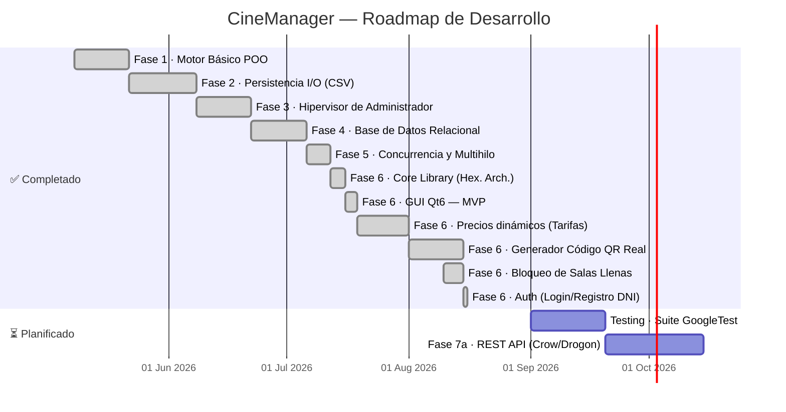

# CineManager — Roadmap Visual de Desarrollo

> **Versión:** 2.1 · **Fecha:** Agosto 2026

---

## 📅 Timeline General — Fases del Proyecto

---

## 🔍 Estado Actual Detallado — Fase 6 (GUI Qt6)

### Flujo de Compra — Pantallas Implementadas

| # | Pantalla | Componente | Estado |
|---|----------|-----------|--------|
| 0 | Selección de Cine | `CineCardWidget` + `QListWidget` | ✅ Funcional |
| 1 | Cartelera de Películas | `MovieCardWidget` + búsqueda/filtro | ✅ Funcional |
| 2 | Selección de Sesión | Agrupación por días + botones horarios (`LLENA` bloqueado) | ✅ Funcional |
| 3 | Mapa de Sala (Butacas) | `QGridLayout` dinámico + multi-selección | ✅ Funcional |
| 3b | Diálogo Modal de Tarifas | `TarifasDialog` (Adulto, Niño, Jubilado, Estudiante) | ✅ Funcional |
| 4 | Ticket de Compra | HTML rico + QR Real Escaneable + Desglose tarifas | ✅ **Funcional (Agosto 2026)** |

### Funcionalidades de la GUI — Checklist de Estado

#### 🎟️ Flujo Cliente (Taquilla)
- [x] Visualización de cines disponibles
- [x] Cartelera de películas por cine
- [x] Búsqueda de películas por texto
- [x] Filtrado de películas por género
- [x] Vista de sesiones agrupadas por día
- [x] **Detección y bloqueo visual de salas llenas (`LLENA`)**
- [x] Mapa visual de sala con butacas
- [x] Selección múltiple de asientos (`std::set`)
- [x] **Precio dinámico real y Tarifas** (`TarifasDialog` + guardado SQLite)
- [x] **Generación real de QR** (Librería Nayuki C++20 + `QrHelper` Qt)
- [x] Confirmación de compra con ticket HTML y desglose por entrada
- [x] **Autenticación de usuario** (Login/Registro por DNI, modo invitado y Checkout Gatekeeper)

---

## 🔧 Backlog Técnico Consolidado

| ID | Módulo | Problema | Severidad | Estado |
|----|--------|---------|-----------|--------|
| **DT-04** | `mainwindow.cpp` | **Precio hardcodeado 7.50€** | 🟡 Media | ✅ **RESUELTO** |
| **DT-05** | `main_gui.cpp` | **Ruta `style.qss` relativa al CWD** | 🟡 Media | ✅ **RESUELTO** |
| **DT-08** | `mainwindow.cpp` | **QR mock estático `qr_mock.jpg`** | 🟢 Baja | ✅ **RESUELTO** |
| DT-02 | `database.cpp` | `PRAGMA foreign_keys = ON` no activado | 🔴 Alta | ⏳ Pendiente |
| DT-09 | Global | Ausencia de tests automatizados | 🔴 Alta | ⏳ Pendiente |
| DT-01 | `database.cpp` | Ruta de DB heurística frágil | 🟡 Media | ⏳ Pendiente |
| DT-03 | `database.cpp` | Sin `PRAGMA journal_mode = WAL` | 🟡 Media | ⏳ Pendiente |
| DT-10 | `datamanager.cpp` | TOCTOU en `eliminarReserva()` | 🟡 Media | ⏳ Pendiente |
